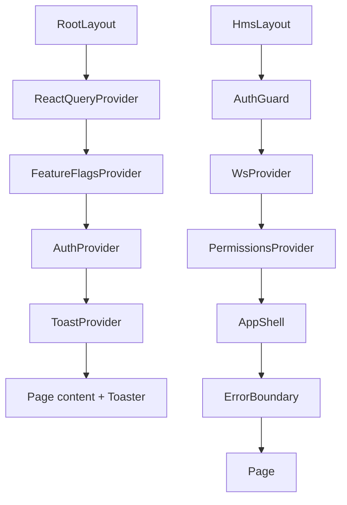
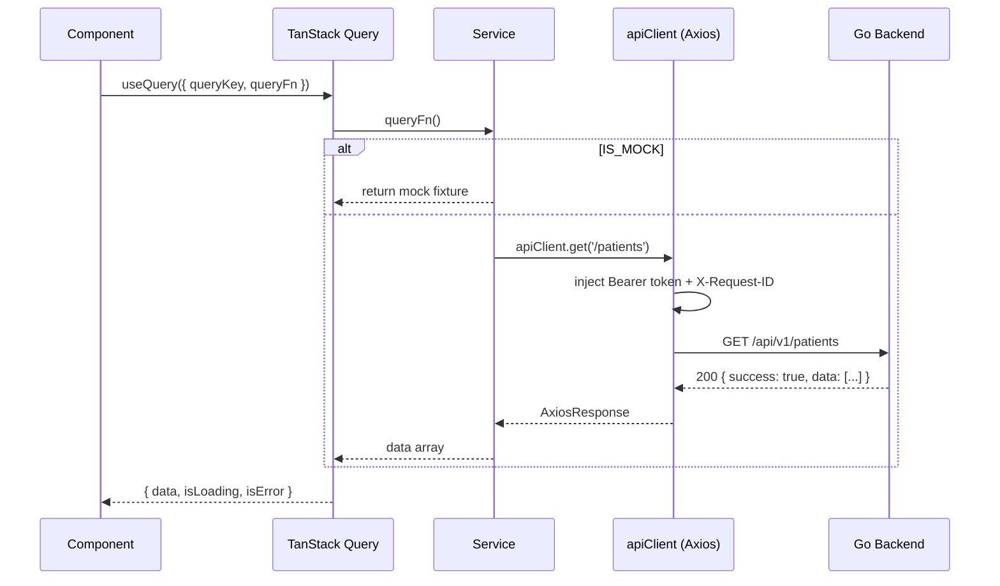

# MYHxCare HMS — Frontend Engineering Handbook

> **Multi-tenant SaaS Hospital Management System** for Nigerian university teaching hospitals.
> Currently live at Nnamdi Azikiwe University Medical Centre (UniZik), Awka — Tenant #1.

---

## Table of Contents

1. [Project Overview](#1-project-overview)
2. [Technology Stack](#2-technology-stack)
3. [Architecture Overview](#3-architecture-overview)
4. [Project Structure](#4-project-structure)
5. [Local Development Setup](#5-local-development-setup)
6. [Environment Variables](#6-environment-variables)
7. [Engineering Principles](#7-engineering-principles)
8. [Role-Based Workspace Architecture](#8-role-based-workspace-architecture)
9. [Module Overview](#9-module-overview)
10. [Routing Strategy](#10-routing-strategy)
11. [State Management](#11-state-management)
12. [API Integration](#12-api-integration)
13. [UI Standards](#13-ui-standards)
14. [Responsive Design Standards](#14-responsive-design-standards)
15. [Component Standards](#15-component-standards)
16. [User Experience Standards](#16-user-experience-standards)
17. [Performance Standards](#17-performance-standards)
18. [Security](#18-security)
19. [Accessibility](#19-accessibility)
20. [Testing Strategy](#20-testing-strategy)
21. [Coding Standards](#21-coding-standards)
22. [Git Workflow](#22-git-workflow)
23. [Development Workflow](#23-development-workflow)
24. [Future Roadmap](#24-future-roadmap)
25. [Contributing Guidelines](#25-contributing-guidelines)
26. [Troubleshooting](#26-troubleshooting)
27. [Frequently Asked Questions](#27-frequently-asked-questions)
28. [Appendix](#28-appendix)

---

## 1. Project Overview

### Purpose

MYHxCare HMS is a **multi-tenant SaaS Hospital Management System** built for Nigerian university teaching hospitals. Each hospital operates as an isolated tenant on a shared platform, with its own staff roster, patient data, billing configuration, and feature set. The platform digitises and unifies every clinical and administrative workflow: patient registration, outpatient and inpatient encounters, laboratory, pharmacy, billing, emergency care, ward management, duty rostering, and system administration.

**Nnamdi Azikiwe University Medical Centre (NAUTH)**, Awka, is Tenant #1 — the first hospital live on the platform.

The frontend is a **role-scoped, workspace-driven** web application. Every staff member who logs in sees only the screens, data, and actions permitted by their clinical role and their hospital's configuration. A consultant physician never sees the billing officer's revenue reports. A pharmacist never sees the ward manager's bed allocation controls. This is not just a UX concern — it is a patient safety and data governance requirement.

### Vision

MYHxCare is a platform product — not a bespoke installation. Every university teaching hospital in Nigeria is a potential tenant. Each tenant runs on the same codebase and infrastructure, with full data isolation and per-tenant configuration (feature flags, pharmacy locations, department structure, pricing).

Every architectural decision — from the `tenant_id` JWT claim to the workspace routing system to the query key naming conventions — is a platform-level decision, not a single-hospital one.

### Business Goals

- Operate as a subscription SaaS platform serving multiple Nigerian university teaching hospitals
- Digitise and unify clinical workflows for each onboarded hospital tenant
- Reduce prescription errors through digital prescribing with allergy cross-checking
- Accelerate patient flow through real-time OPD queue management
- Provide hospital management with live operational dashboards and financial reports

### Target Users

| Role                       | Workspace         | Primary concern                             |
| -------------------------- | ----------------- | ------------------------------------------- |
| Records Officer            | Medical Records   | Patient registration, file management       |
| Doctor / Consultant        | Clinical Services | OPD encounters, prescriptions, lab orders   |
| Head of Department         | Clinical Services | Department oversight, duty approval         |
| Nurse / Matron             | Nursing           | Vital signs, nursing notes, ward handovers  |
| Ward Manager               | Ward Management   | Bed allocation, admission/discharge         |
| Pharmacist                 | Pharmacy          | Prescription dispensing, inventory          |
| Lab Scientist / Technician | Laboratory        | Order processing, result entry              |
| Billing Officer            | Finance           | Charges, invoices, payments                 |
| Emergency Doctor / Nurse   | Emergency         | A&E queue, triage, resuscitation protocols  |
| System Administrator       | Administration    | Staff accounts, roles, system configuration |

### Healthcare Context

This system operates in a **clinical environment**. Errors in clinical software are not bugs — they are patient safety events. Every engineering decision in this codebase carries that weight:

- Mutations never auto-retry (a duplicate prescription is a patient safety incident)
- Allergy information is displayed on every clinical screen
- Triage priorities use internationally recognised Manchester Triage System colour coding
- All dates are rendered in West Africa Time (WAT, UTC+1) in DD/MM/YYYY format
- All monetary values are in Nigerian Naira (₦) — never in kobo or any other unit

---

## 2. Technology Stack

| Concern            | Technology               | Version    | Rationale                                                                                                                                                                              |
| ------------------ | ------------------------ | ---------- | -------------------------------------------------------------------------------------------------------------------------------------------------------------------------------------- |
| Framework          | Next.js                  | 16.2.9     | App Router gives us server components, streaming SSR, and first-class file-system routing. Standalone output mode enables Docker deployment without a Node process manager.            |
| Language           | TypeScript               | 5.x        | Strict mode throughout. `exactOptionalPropertyTypes` is enabled — `undefined` and absent properties are distinct.                                                                      |
| Styling            | Tailwind CSS             | 4.x        | CSS-variable-first theming via `@theme inline`. No separate config file in v4. Custom breakpoints (`xs: 375px`, `3xl: 1920px`) added for clinical tablet and large dashboard displays. |
| HTTP Client        | Axios                    | 1.18.x     | Interceptor model handles Bearer token injection, silent token refresh on 401, and correlation ID headers in a single place.                                                           |
| Server State       | TanStack Query           | 5.x        | Query key factories in `src/constants/queryKeys.ts` provide typed, collision-free cache keys for all 9 HMS domains.                                                                    |
| Forms              | React Hook Form + Zod    | 7.x + 4.x  | Zod schemas are the single source of truth for both client-side validation and TypeScript types. No form state lives in global state.                                                  |
| UI Components      | Radix UI (unified)       | 1.6.x      | Headless, accessible primitives. The `radix-ui` package ships all primitives as a single dependency.                                                                                   |
| Component Variants | class-variance-authority | 0.7.x      | Type-safe variant props for shared components without prop drilling.                                                                                                                   |
| Icons              | Lucide React             | 1.22.x     | Consistent, tree-shakeable SVG icon set.                                                                                                                                               |
| Runtime            | Node.js                  | 22 (LTS)   | Specified in `.nvmrc`. Use `nvm use` to align versions across the team.                                                                                                                |
| Package Manager    | npm                      | —          | Lock file committed. Never use `yarn` or `pnpm` on this project.                                                                                                                       |
| Testing (Unit)     | Vitest + Testing Library | 4.x + 16.x | Vitest is API-compatible with Jest but integrates natively with the build tooling.                                                                                                     |
| Testing (E2E)      | Playwright               | 1.61.x     | Full browser automation for critical user flows.                                                                                                                                       |
| Git Hooks          | Husky + lint-staged      | 9.x + 16.x | Pre-commit runs ESLint + Prettier on staged files only. Commit-msg runs commitlint.                                                                                                    |
| Commit Standard    | Conventional Commits     | —          | Enforced by commitlint with `@commitlint/config-conventional`.                                                                                                                         |
| Animations         | tw-animate-css           | 1.4.x      | Provides `animate-in`, `fade-in`, `slide-in-from-*` utilities compatible with Tailwind v4.                                                                                             |
| Offline Storage    | idb                      | 8.x        | IndexedDB wrapper used in the offline request queue layer.                                                                                                                             |
| PWA                | Service Worker           | —          | Custom SW in `public/sw.js` handles asset caching and offline page fallback.                                                                                                           |
| CI/CD              | GitHub Actions           | —          | Separate workflows for CI (lint, typecheck, test on PR) and CD (deploy to staging on merge to main).                                                                                   |
| Deployment         | Docker → DigitalOcean    | —          | `next build` with `output: standalone` produces a minimal image. Deployed to a DigitalOcean web-01 droplet.                                                                            |

### Why Next.js and not Vite + React Router?

This is a server-rendered healthcare application, not a static SPA. Next.js App Router gives us:

- **Server Components** for zero-bundle-size data fetching on pages that don't need interactivity
- **Streaming** for progressive loading of complex clinical dashboards
- **Route Groups** (`(public)` / `(hms)`) to enforce authentication boundaries at the layout level
- **`output: standalone`** for a self-contained Docker image with no external Node server required
- **Built-in security headers** via `next.config.ts` without a separate reverse proxy

A Vite + React Router SPA would require a separate server to serve the HTML, add complexity to the Docker image, and lose all of the above.

---

## 3. Architecture Overview

### High-Level Architecture

```
┌─────────────────────────────────────────────────────────────┐
│                        Browser                               │
│                                                              │
│   ┌──────────────────────────────────────────────────────┐  │
│   │               Next.js App Router                     │  │
│   │                                                      │  │
│   │  ┌────────────────┐    ┌────────────────────────┐   │  │
│   │  │  (public)      │    │  (hms)                 │   │  │
│   │  │  /login        │    │  AuthGuard              │   │  │
│   │  │  /password-    │    │  WsProvider             │   │  │
│   │  │    reset       │    │  PermissionsProvider    │   │  │
│   │  └────────────────┘    │  AppShell               │   │  │
│   │                        │  ┌─────────────────┐   │   │  │
│   │                        │  │  Domain Modules  │   │   │  │
│   │                        │  │  (feature-based) │   │   │  │
│   │                        │  └─────────────────┘   │   │  │
│   │                        └────────────────────────┘   │  │
│   └──────────────────────────────────────────────────────┘  │
│                                                              │
│   ┌──────────────────────────────────────────────────────┐  │
│   │              Global Provider Tree                    │  │
│   │  ReactQueryProvider > FeatureFlagsProvider >         │  │
│   │  AuthProvider > ToastProvider                        │  │
│   └──────────────────────────────────────────────────────┘  │
└─────────────────────────────────────────────────────────────┘
          │ HTTPS / WSS
          ▼
┌─────────────────────────────────────────────────────────────┐
│                    Go Backend (REST + WS)                    │
│                    /api/v1/*                                 │
│                    /ws                                       │
└─────────────────────────────────────────────────────────────┘
```

### Feature Module Architecture

Every HMS domain (patients, pharmacy, lab, etc.) is encapsulated as a **feature module** under `src/features/`. The pattern enforces a consistent internal structure:

```
src/features/<domain>/
├── __mocks__/       # Mock fixtures — consumed when NEXT_PUBLIC_APP_ENV=development
├── components/      # Domain-scoped React components
├── hooks/           # TanStack Query hooks (useXxxQuery, useXxxMutation)
├── schemas/         # Zod schemas for forms in this domain
├── services/        # HTTP service layer (IS_MOCK gate inside each method)
└── types/           # Domain-specific types (if needed beyond src/types/)
```

Components in `src/features/<domain>/components/` are **not** re-exported globally. They are imported by the page that needs them. Shared components that cross domain boundaries live in `src/components/shared/` or `src/components/clinical/`.

### Data Flow

```
Page (Server Component)
    └── Feature Component (Client Component — 'use client')
            ├── useXxxQuery()           → TanStack Query
            │       └── xxxService.get()  → IS_MOCK ? fixture : apiClient.get()
            ├── useXxxMutation()        → TanStack Query
            │       └── xxxService.post() → IS_MOCK ? fixture : apiClient.post()
            └── useToast()              → ToastProvider (success / error feedback)
```

### Mock-First Development

All service methods implement an **IS_MOCK gate**:

```ts
const IS_MOCK = process.env['NEXT_PUBLIC_APP_ENV'] === 'development';

async function getPatients(): Promise<Patient[]> {
  if (IS_MOCK) {
    const { getMockPatients } = await import('@features/patients/__mocks__/patientFixtures');
    await sleep(400); // simulate network latency
    return getMockPatients();
  }
  const res = await apiClient.get<ApiListResponse<Patient>>('/patients');
  return res.data.data;
}
```

This means:

- Every screen is fully functional before the Go backend is built for that domain
- Mock fixtures are never bundled in staging or production builds (dynamic import + dead code elimination)
- Switching to real API requires only setting `NEXT_PUBLIC_APP_ENV=staging` — no code changes

---

## 4. Project Structure

```
myhxcare-hms/
├── .github/
│   ├── workflows/
│   │   ├── ci.yml                   # PR checks: lint, typecheck, test
│   │   └── cd-staging.yml           # Deploy to staging on merge to main
│   ├── CODEOWNERS                   # Auto-assign reviewers by directory
│   └── dependabot.yml               # Automated dependency updates
│
├── public/
│   ├── sw.js                        # Service worker (PWA caching + offline)
│   └── *.svg                        # Static assets
│
├── src/
│   ├── app/                         # Next.js App Router — route segments only
│   │   ├── (public)/                # Route group: unauthenticated pages
│   │   │   ├── layout.tsx           # Public layout (no shell, no auth check)
│   │   │   ├── login/
│   │   │   │   └── page.tsx
│   │   │   └── password-reset/
│   │   │       └── page.tsx
│   │   ├── (hms)/                   # Route group: authenticated HMS pages
│   │   │   ├── layout.tsx           # Wraps every HMS page in AuthGuard + AppShell
│   │   │   ├── dashboard/
│   │   │   ├── patients/
│   │   │   ├── encounters/
│   │   │   ├── pharmacy/
│   │   │   ├── lab/
│   │   │   ├── billing/
│   │   │   ├── wards/
│   │   │   ├── emergency/
│   │   │   ├── duty-roster/
│   │   │   ├── admin/
│   │   │   ├── notifications/
│   │   │   ├── collaboration/
│   │   │   └── settings/
│   │   ├── layout.tsx               # Root layout: fonts, providers, Toaster
│   │   ├── globals.css              # Tailwind directives + @theme inline tokens
│   │   ├── manifest.ts              # PWA manifest (generated)
│   │   ├── page.tsx                 # Root redirect to /dashboard
│   │   ├── error.tsx                # Next.js error boundary fallback
│   │   ├── global-error.tsx         # Root error boundary (catches layout errors)
│   │   └── not-found.tsx            # 404 page
│   │
│   ├── components/
│   │   ├── shared/                  # Cross-cutting components (all domains)
│   │   │   ├── AppShell.tsx         # Layout container: sidebar + topbar + main
│   │   │   ├── AppSidebar.tsx       # Role-aware nav, mobile drawer + desktop collapse
│   │   │   ├── AppTopbar.tsx        # Topbar: hamburger, breadcrumbs, user menu
│   │   │   ├── AuthGuard.tsx        # Redirects unauthenticated users; shows overlay
│   │   │   ├── SessionExpiredOverlay.tsx  # In-place re-auth when token expires
│   │   │   ├── ErrorBoundary.tsx    # React class boundary for domain crashes
│   │   │   ├── OfflineBanner.tsx    # Sticky offline / slow-network banner
│   │   │   ├── Toaster.tsx          # Toast notification renderer
│   │   │   ├── PermissionGate.tsx   # Renders children only if permission check passes
│   │   │   ├── FlagGate.tsx         # Renders children only if feature flag is on
│   │   │   └── Forbidden.tsx        # 403 fallback view
│   │   ├── clinical/                # Clinical display primitives (patient-facing data)
│   │   │   ├── AllergyBanner.tsx    # Must appear on every clinical screen
│   │   │   ├── TriagePriorityBadge.tsx  # Colour-coded triage level (P1–P4)
│   │   │   └── VisitStatusBadge.tsx # Colour-coded encounter status
│   │   ├── print/                   # Print-only components (prescription slips etc.)
│   │   └── ui/                      # shadcn/radix component primitives
│   │       └── button.tsx
│   │
│   ├── config/
│   │   └── workspaces.ts            # Nav configuration per WorkspaceId
│   │
│   ├── constants/
│   │   ├── permissions.ts           # Typed PERMISSIONS constant object
│   │   ├── queryKeys.ts             # QK factory — typed TanStack Query keys
│   │   ├── routes.ts                # ROUTES constant — all app paths in one place
│   │   └── pharmacyLocations.ts     # Pharmacy campus location definitions (seeded per tenant)
│   │
│   ├── features/                    # Domain feature modules
│   │   ├── auth/
│   │   │   ├── __mocks__/
│   │   │   ├── components/
│   │   │   ├── hooks/
│   │   │   ├── schemas/
│   │   │   └── services/
│   │   ├── patients/                # (built as screens arrive from design)
│   │   ├── encounters/
│   │   ├── pharmacy/
│   │   ├── lab/
│   │   ├── billing/
│   │   ├── wards/
│   │   ├── emergency/
│   │   ├── duty-roster/
│   │   ├── admin/
│   │   ├── notifications/
│   │   └── collaboration/
│   │
│   ├── hooks/                       # Global reusable hooks
│   │   ├── useAuth.ts               # Re-exports useAuth from AuthProvider
│   │   ├── useDebounce.ts           # Generic debounce for search inputs
│   │   ├── useFlag.ts               # useFlag(flagKey) → boolean
│   │   ├── usePagination.ts         # Page / pageSize state with backend param shape
│   │   ├── usePermissions.ts        # Re-exports usePermissions from PermissionsProvider
│   │   ├── useToast.ts              # success/error/warning/info toast helpers
│   │   └── useWs.ts                 # Re-exports useWs from WsProvider
│   │
│   ├── lib/
│   │   ├── api/
│   │   │   ├── client.ts            # Axios instance + 401 silent refresh interceptor
│   │   │   ├── idempotency.ts       # generateIdempotencyKey() for safe mutations
│   │   │   └── types.ts             # ApiSuccessResponse, ApiListResponse, ApiError
│   │   ├── auth/
│   │   │   ├── authService.ts       # login, logout, refresh, getMe, password reset
│   │   │   ├── jwt.ts               # decodeJwt, isTokenExpired, msUntilExpiry
│   │   │   └── tokenStore.ts        # Access token (memory) + refresh token (sessionStorage)
│   │   ├── pwa/
│   │   │   └── ServiceWorkerRegistrar.tsx
│   │   ├── offline/                 # Offline request queue (future)
│   │   └── websocket/               # WS emitter utilities (future)
│   │
│   ├── providers/                   # React context providers
│   │   ├── AuthProvider.tsx         # Auth state, login/logout, silent refresh
│   │   ├── FeatureFlagsProvider.tsx # Feature flag context + useFeatureFlags()
│   │   ├── PermissionsProvider.tsx  # Permission set derived from User.permissions
│   │   ├── ReactQueryProvider.tsx   # QueryClient with clinical-safe defaults
│   │   ├── ToastProvider.tsx        # Toast queue, add/remove, auto-dismiss
│   │   └── WsProvider.tsx           # WebSocket connection, reconnect, subscribe()
│   │
│   ├── types/                       # Shared TypeScript types
│   │   ├── auth.types.ts            # User, JwtClaims, WorkspaceRole, Session, TrustedDevice
│   │   ├── patient.types.ts         # Patient, PatientSummary, Allergy, Insurance
│   │   ├── visit.types.ts           # Encounter, VisitStatus, state machine
│   │   └── ws.types.ts              # WsEventMap, RawWsMessage, per-event payloads
│   │
│   ├── utils/                       # Pure functions — no React, no side effects
│   │   ├── currency.ts              # formatCurrency, parseCurrencyInput (₦, not kobo)
│   │   ├── datetime.ts              # formatDate/Time in WAT, toRelativeTime
│   │   ├── errorMapper.ts           # Backend error code → user-facing string
│   │   └── triage.ts                # TRIAGE_DISPLAY, triageSortWeight, isHighPriority
│   │
│   └── env.ts                       # Zod-validated env — throws on startup if invalid
│
├── .env.example                     # Template — copy to .env.local
├── .env.test                        # Test environment overrides
├── .gitignore
├── .nvmrc                           # Node version: 22
├── .prettierrc
├── .prettierignore
├── commitlint.config.js
├── components.json                  # shadcn/ui config
├── Dockerfile
├── eslint.config.mjs
├── next.config.ts                   # Security headers, standalone output, CSP
├── package.json
├── package-lock.json
├── playwright.config.ts
├── postcss.config.mjs
└── tsconfig.json
```

---

## 5. Local Development Setup

### Prerequisites

| Tool    | Version  | Notes                                                                              |
| ------- | -------- | ---------------------------------------------------------------------------------- |
| Node.js | 22.x LTS | Use `nvm use` from the project root                                                |
| npm     | 10.x+    | Comes with Node 22                                                                 |
| Git     | 2.40+    |                                                                                    |
| nvm     | Any      | `curl -o- https://raw.githubusercontent.com/nvm-sh/nvm/v0.39.7/install.sh \| bash` |

### Installation

```bash
# 1. Clone the repository
git clone <repo-url> myhxcare-hms
cd myhxcare-hms

# 2. Use the correct Node version
nvm use

# 3. Install dependencies
npm install

# 4. Copy environment variables
cp .env.example .env.local
```

### Environment Setup

Open `.env.local` and configure the three required variables (see [Section 6](#6-environment-variables)).

For local mock development, use:

```env
NEXT_PUBLIC_API_BASE_URL=http://localhost:8080
NEXT_PUBLIC_WS_URL=ws://localhost:8080
NEXT_PUBLIC_APP_ENV=development
```

With `NEXT_PUBLIC_APP_ENV=development`, all API calls are intercepted by mock fixtures. You do not need the Go backend running to work on the frontend.

### Development Commands

```bash
# Start development server (http://localhost:3000)
npm run dev

# Type check
npm run type-check

# Lint (report only)
npm run lint

# Lint and auto-fix
npm run lint:fix

# Format with Prettier
npm run format

# Check formatting without writing
npm run format:check

# Run unit tests (single run)
npm test

# Run unit tests in watch mode
npm run test:watch

# Run unit tests with coverage
npm run test:coverage

# Run end-to-end tests (headless)
npm run e2e

# Run E2E with Playwright UI
npm run e2e:ui

# Run E2E in headed mode (visible browser)
npm run e2e:headed

# Production build
npm run build

# Start production server locally
npm start
```

### Pre-commit Hooks

Husky installs automatically on `npm install`. Before every commit, lint-staged runs:

- `eslint --fix --max-warnings=0` on staged `.ts` / `.tsx` files
- `prettier --write` on all staged files

The commit will fail if ESLint reports any errors after auto-fix. This is non-negotiable — fix the errors before committing.

---

## 6. Environment Variables

All environment variables are validated at startup by `src/env.ts` using Zod. If any required variable is missing or invalid, the application throws immediately with a descriptive error listing the offending variables. It will not start with a broken environment.

| Variable                   | Required | Values                                     | Purpose                                                                                                                                                  |
| -------------------------- | -------- | ------------------------------------------ | -------------------------------------------------------------------------------------------------------------------------------------------------------- |
| `NEXT_PUBLIC_API_BASE_URL` | Yes      | URL                                        | Base URL of the Go REST API. Injected into Axios `baseURL`. Also used in the CSP `connect-src` directive at build time. Example: `http://localhost:8080` |
| `NEXT_PUBLIC_WS_URL`       | Yes      | URL                                        | WebSocket endpoint. Used by `WsProvider` to open the persistent connection. Example: `ws://localhost:8080`                                               |
| `NEXT_PUBLIC_APP_ENV`      | Yes      | `development` \| `staging` \| `production` | Controls the IS_MOCK gate (development → mock fixtures), feature flag visibility, and logging verbosity. **This is not the same as `NODE_ENV`.**         |

### Security Considerations

- All three variables are `NEXT_PUBLIC_*` — they are inlined into the client bundle at build time. **Never put secrets, API keys, or credentials in `NEXT_PUBLIC_*` variables.**
- `.env.local` is gitignored. Never commit it.
- `.env.example` is committed and must be kept up to date as new variables are added.
- The `NEXT_PUBLIC_API_BASE_URL` origin is extracted at build time and inserted into the `Content-Security-Policy` `connect-src` directive in `next.config.ts`. If this URL changes between environments, a new build is required.

---

## 7. Engineering Principles

### 1. Feature-First, Not Layer-First

Code is organised by **business domain** (`src/features/patients/`), not by technical layer (`src/services/`, `src/components/`). Everything a feature needs — its components, hooks, schemas, services, and mocks — lives together. Deleting a feature means deleting one folder.

### 2. Mock-First Development

Every feature is built and fully functional with mock data before the backend API is ready. The IS_MOCK gate is the single switch between mock and real data. Mock fixtures are never bundled in production.

### 3. Single Source of Truth

- **Routes**: defined once in `src/constants/routes.ts`. Never hard-code a path string in a component.
- **Permissions**: defined once in `src/constants/permissions.ts`. Never check raw strings in components.
- **Query keys**: defined once in `src/constants/queryKeys.ts`. All invalidation targets the factory, never a raw array.
- **Error messages**: defined once in `src/utils/errorMapper.ts`. Never hard-code user-facing error strings in service files.

### 4. No Mutations Auto-Retry

TanStack Query mutations are configured with `retry: 0`. A failed mutation must be explicitly re-attempted by the user. Retrying a clinical write (dispense, admit, prescribe) silently could produce duplicate records — a patient safety incident.

### 5. Explicit Over Implicit

`exactOptionalPropertyTypes` is enabled in TypeScript. `undefined` and absent are distinct. Spread patterns must account for this. The type system is strict; make the compiler work for you.

### 6. No Parent Relative Imports

ESLint enforces `@/` path aliases throughout. `import { x } from '../hooks/useX'` is a lint error. This prevents path fragility when files are moved and keeps imports self-documenting.

### 7. Display Standards Are Non-Negotiable

- Dates: DD/MM/YYYY in WAT (Africa/Lagos). Use `formatDate()` from `src/utils/datetime.ts`.
- Currency: ₦ prefix, 2 decimal places. Use `formatCurrency()` from `src/utils/currency.ts`. Amounts are always in Naira — never in kobo.
- Triage: use `TRIAGE_DISPLAY` and `TriagePriorityBadge`. Never hard-code colours for clinical priority levels.

### 8. Accessibility Is a Clinical Requirement

Clinicians use this system in high-stress environments, often quickly scanning screens for critical information. WCAG 2.2 AA compliance is the minimum. Keyboard navigation and screen reader support are not optional.

---

## 8. Role-Based Workspace Architecture

### Overview

MYHxCare uses a **workspace model** rather than a flat permissions model. Each staff role maps to exactly one workspace. The workspace determines the navigation structure, the dashboard layout, and the home route after login.

```
WorkspaceRole (14 roles)  →  WorkspaceId (9 workspaces)  →  Nav config + home route
```

### Role → Workspace Mapping

```typescript
RECORDS_OFFICER    → records
DOCTOR             → clinical
CONSULTANT         → clinical
HOD                → clinical
NURSE              → nursing
MATRON             → nursing
WARD_MANAGER       → ward-management
PHARMACIST         → pharmacy
LAB_SCIENTIST      → laboratory
LAB_TECHNICIAN     → laboratory
BILLING_OFFICER    → finance
EMERGENCY_NURSE    → emergency
EMERGENCY_DOCTOR   → emergency
SYSTEM_ADMIN       → administration
```

### How It Works

1. On login, the JWT access token encodes `workspace_role` in its claims.
2. `AuthProvider` decodes the token and stores the user's `WorkspaceRole`.
3. `AppSidebar` calls `WORKSPACE_NAV[resolveWorkspace(user.workspaceRole)]` to render the correct navigation for that session — no runtime API call required.
4. After login, the user is redirected to `getWorkspaceHomeRoute(workspaceRole)` — the landing page appropriate for their role.

### Permission Guards

Individual UI elements within a workspace are further guarded by fine-grained permissions stored on the `User.permissions` array. Use `PermissionGate` to conditionally render actions:

```tsx
<PermissionGate permission={PERMISSIONS.PHARMACY_DISPENSE}>
  <DispenseButton />
</PermissionGate>

<PermissionGate anyOf={[PERMISSIONS.LAB_ORDERS_READ, PERMISSIONS.LAB_ORDERS_WRITE]}>
  <LabOrderTable />
</PermissionGate>
```

`PermissionGate` renders `null` by default when the check fails. Pass a `fallback` prop for explicit handling (e.g. a `<Forbidden />` view or a disabled state).

### Feature Flags

Feature flags gate entire modules that are not yet production-ready. Use `FlagGate` at the page level:

```tsx
<FlagGate flag="collaboration" fallback={<ComingSoon />}>
  <CollaborationModule />
</FlagGate>
```

Flag defaults are defined in `FeatureFlagsProvider`. The roadmap moves this to a per-tenant API endpoint (`/tenants/{id}/flags`) so each hospital can have a different feature set without a code deploy.

---

## 9. Module Overview

### Auth

Password-based authentication with silent token refresh. Covers login, password reset (request + set), active sessions management, and trusted device management.

**Key files**: `src/lib/auth/authService.ts`, `src/providers/AuthProvider.tsx`, `src/features/auth/`

### Dashboard

Role-scoped operational dashboards. Each workspace sees different KPI widgets: a doctor sees OPD queue depth and pending lab results; a billing officer sees daily revenue and outstanding invoices.

**Status**: Awaiting screen designs.

### Medical Records (Patients)

Patient registration, demographic management, file search, patient folder (medical history timeline), allergy management, insurance information, and next-of-kin records.

**Key types**: `Patient`, `PatientSummary`, `Allergy`, `Insurance` in `src/types/patient.types.ts`

**Status**: Awaiting screen designs.

### Clinical Services (Encounters)

OPD queue management, encounter workspace (consultation room), clinical notes (SOAP format), prescription writing with allergy cross-check, lab order requests, and referral management.

**Key types**: `Encounter`, `VisitStatus`, state machine in `src/types/visit.types.ts`

**Status**: Awaiting screen designs.

### Nursing

Ward-level patient monitoring, vital signs entry, nursing notes, care plans, medication administration records, and shift handover documentation.

**Status**: Awaiting screen designs.

### Ward Management

Bed allocation grid, patient admission, transfer between wards, and discharge processing. Real-time bed occupancy updates via WebSocket.

**WS events**: `patient.admitted`, `patient.discharged`, `patient.transferred`

**Status**: Awaiting screen designs.

### Laboratory

Test order worklist, sample reception and tracking, result entry, critical value flagging, and blood bank management.

**WS event**: `lab.result_ready` (triggers alert when critical result is posted)

**Status**: Awaiting screen designs.

### Pharmacy

Prescription dispensing queue, drug inventory management, batch/expiry tracking, multi-location stock transfers, and dispense ledger. Pharmacy locations are tenant-configured — NAUTH (Tenant #1) has 5 campus locations defined in `src/constants/pharmacyLocations.ts`.

**Key constants**: `PHARMACY_LOCATIONS` in `src/constants/pharmacyLocations.ts`

**WS event**: `prescription.dispensed`

**Status**: Awaiting screen designs.

### Billing / Finance

Service charge posting, invoice generation, payment capture (cash, POS, NHIA), receipt printing, and revenue reporting. All amounts in Naira.

**Status**: Awaiting screen designs.

### Emergency (A&E)

A&E registration queue with Manchester Triage System priority assignment, resuscitation bay tracking, and critical alert broadcasting.

**WS event**: `alert.critical` (must render immediately regardless of current screen)

**Status**: Awaiting screen designs.

### Duty Roster (Workforce Management)

Shift roster calendar, shift template library, staff assignment, on-call schedule, and workforce analytics. Sub-routes are scaffolded; screens await design.

### Administration

Staff account management, role assignment, service price configuration, operational and audit reports, and system settings.

**Status**: Awaiting screen designs.

### Notifications

In-app notification centre. New notifications arrive via WebSocket (`notification.new`) and update the unread count badge in real time.

**Status**: Awaiting screen designs.

### Collaboration

Internal case-linked messaging threads. Doctors, nurses, and specialists can discuss a specific encounter without leaving the system. Deferred — `collaboration` feature flag is `false` by default.

**Status**: Awaiting screen designs.

### Settings

Account security centre. Currently includes Active Sessions (`/settings/sessions`) and Trusted Devices (`/settings/devices`). More settings sections will be added as the product evolves.

---

## 10. Routing Strategy

### Route Groups

Next.js route groups (`(groupName)`) organise routes into authentication zones without affecting URLs:

```
(public)  → /login, /password-reset     No auth required
(hms)     → /dashboard, /patients, …    AuthGuard required
```

The `(hms)/layout.tsx` wraps every HMS page in:

```tsx
<AuthGuard>
  {' '}
  ← redirect to /login if unauthenticated
  <WsProvider>
    {' '}
    ← open WebSocket connection
    <PermissionsProvider>
      <AppShell>
        {' '}
        ← sidebar + topbar
        <ErrorBoundary>{children}</ErrorBoundary>
      </AppShell>
    </PermissionsProvider>
  </WsProvider>
</AuthGuard>
```

### Route Constants

Never write path strings in components. Use `ROUTES` from `src/constants/routes.ts`:

```typescript
// ✅ Correct
import { ROUTES } from '@/constants/routes';
router.push(ROUTES.patients);
router.push(ROUTES.patientProfile(patient.id));

// ❌ Wrong
router.push('/patients');
router.push(`/patients/${patient.id}`);
```

### Nested Routes

Sub-routes within a domain follow a consistent pattern:

```
/encounters              → Encounter list
/encounters/[id]         → Encounter workspace
/encounters/[id]/notes   → Clinical notes tab
/lab/orders              → Order worklist
/lab/results             → Result entry
```

Dynamic segments use Next.js `[param]` convention. The `params` object is typed via the page's `Props` type.

### Async Search Params (Next.js 15+)

In Next.js 15 and above, `searchParams` in page components is a Promise and must be awaited:

```typescript
// ✅ Correct (Next.js 15+ pattern)
type SearchParams = Promise<{ token?: string }>;

export default async function PasswordResetPage({
  searchParams,
}: {
  searchParams: SearchParams;
}) {
  const { token } = await searchParams;
  return token ? <PasswordResetSetForm token={token} /> : <PasswordResetRequestForm />;
}
```

---

## 11. State Management

MYHxCare uses **three distinct state layers**. Never use one layer for another's job.

### Server State — TanStack Query

All data that originates from the API is **server state**. It lives in the TanStack Query cache and is never duplicated in React state.

```typescript
// Every domain has a typed query key factory
import { QK } from '@/constants/queryKeys';

// List query with pagination params
useQuery({
  queryKey: QK.patients.list({ page: 1, page_size: 20 }),
  queryFn: () => patientsService.getPatients({ page: 1, page_size: 20 }),
});

// Invalidate after mutation
queryClient.invalidateQueries({ queryKey: QK.patients.all() });
```

**Default configuration** (in `ReactQueryProvider`):

| Setting                | Value  | Reason                                                          |
| ---------------------- | ------ | --------------------------------------------------------------- |
| `staleTime`            | 30 s   | Clinical data changes frequently — refresh after 30 seconds     |
| `gcTime`               | 5 min  | Keep inactive queries warm for fast back-navigation             |
| `retry` (queries)      | 2      | Network glitches should not disrupt a clinician                 |
| `retry` (mutations)    | 0      | Clinical writes must never auto-retry                           |
| `refetchOnWindowFocus` | `true` | Clinicians leave and return to the tab — always show fresh data |

### Form State — React Hook Form

All form state is managed locally by React Hook Form with Zod resolvers. Form values never touch global state or the TanStack Query cache.

```typescript
const schema = z.object({
  firstName: z.string().min(1, 'Required'),
  dateOfBirth: z.string().min(1, 'Required'),
});

const { register, handleSubmit, formState } = useForm({
  resolver: zodResolver(schema),
});
```

### UI State — useState / useReducer

Toggle states, modal open/close, pagination page numbers, search query strings — these are local component state and stay local.

The `usePagination` hook standardises pagination state across all list screens:

```typescript
const { page, pageSize, params, setPage, nextPage, prevPage, reset } = usePagination();

// Pass params directly to the query key factory
useQuery({
  queryKey: QK.patients.list({ ...params, q: debouncedSearch }),
  queryFn: () => patientsService.getPatients({ ...params, q: debouncedSearch }),
});
```

### Global App State — React Context

The only global state is auth status and user identity (`AuthProvider`), feature flags (`FeatureFlagsProvider`), permission set (`PermissionsProvider`), WebSocket connection (`WsProvider`), and toast queue (`ToastProvider`). These are all initialised at the root layout and never re-rendered unnecessarily.

---

## 12. API Integration

### API Client

`src/lib/api/client.ts` exports a single Axios instance (`apiClient`) configured with:

- `baseURL`: `${NEXT_PUBLIC_API_BASE_URL}/api/v1`
- `timeout`: 30 seconds
- **Request interceptor**: injects `Authorization: Bearer <token>` and a per-request `X-Request-ID` (UUIDv4 for correlation tracing)
- **Response interceptor**: on 401, attempts a single silent token refresh using a shared in-flight promise (so concurrent 401s don't trigger multiple refresh calls), then retries the original request

### Token Storage

| Token         | Storage          | Reason                                                    |
| ------------- | ---------------- | --------------------------------------------------------- |
| Access token  | Memory variable  | Cleared on page reload; impossible to read via XSS        |
| Refresh token | `sessionStorage` | Survives page reload; cleared when the browser tab closes |

### Error Handling

All HTTP errors are normalised to `ApiError` instances:

```typescript
class ApiError extends Error {
  code: string; // backend error code, e.g. 'INVALID_CREDENTIALS'
  status: number; // HTTP status code
  requestId?: string;
}
```

In components, catch `ApiError` and look up the user-facing message:

```typescript
import { getErrorMessage } from '@utils/errorMapper';

try {
  await mutation.mutateAsync(payload);
} catch (err) {
  if (err instanceof ApiError) {
    toast.error(getErrorMessage(err.code));
  }
}
```

### Idempotency

Mutations that must be safe to submit only once (dispense, admit, create charge) generate an idempotency key and include it as the `Idempotency-Key` header:

```typescript
import { generateIdempotencyKey } from '@lib/api/idempotency';

await apiClient.post('/pharmacy/dispenses', payload, {
  headers: { 'Idempotency-Key': generateIdempotencyKey() },
});
```

### Response Envelope

Every API response from the Go backend conforms to one of:

```typescript
// Single resource
{ success: true; data: T; meta: { request_id: string } }

// Paginated list
{ success: true; data: T[]; pagination: Pagination; meta: ApiMeta }

// Error
{ success: false; error: { code: string; message: string; details?: Record<string, unknown> } }
```

Field names are exact — do not rename (e.g. `page_size`, not `limit` or `pageLimit`).

### Pagination Parameters

```typescript
type PaginationParams = {
  page?: number;
  page_size?: number; // default 20, max 100
  sort?: string; // e.g. 'created_at:desc'
  q?: string; // search query
  from?: string; // ISO date
  to?: string; // ISO date
};
```

### WebSocket

`WsProvider` opens a single authenticated WebSocket connection per authenticated session. Domain components subscribe to typed events:

```typescript
const { subscribe, isConnected, isPolling } = useWs();

useEffect(() => {
  return subscribe('lab.result_ready', (payload) => {
    toast.info(`Result ready: ${payload.test_name}`);
    void queryClient.invalidateQueries({ queryKey: QK.lab.results() });
  });
}, [subscribe, queryClient]);
```

When the connection fails after 5 reconnect attempts, `isPolling` becomes `true`. Domain components should fall back to `refetchInterval` polling in this state.

---

## 13. UI Standards

### Component Library

MYHxCare uses [shadcn/ui](https://ui.shadcn.com) components built on Radix UI primitives. Components live in `src/components/ui/`. The `components.json` is configured with `style: radix-nova`.

When you need a UI primitive (Dialog, Select, Popover, etc.) that is not yet in the `ui/` directory, add it using the shadcn CLI:

```bash
npx shadcn@latest add dialog
```

Never install separate Radix packages — the `radix-ui` unified package is already installed.

### Design Tokens

Tokens are defined in `src/app/globals.css` via `@theme inline`. Use semantic token names in component classes, never raw colour values:

```tsx
// ✅ Correct — semantic tokens
<div className="bg-background text-foreground border-border" />
<p className="text-muted-foreground" />
<div className="bg-destructive text-destructive-foreground" />

// ❌ Wrong — raw values
<div className="bg-white text-gray-900 border-gray-200" />
```

### Clinical Display Primitives

| Component                                         | Usage                                                     |
| ------------------------------------------------- | --------------------------------------------------------- |
| `<AllergyBanner allergies={patient.allergies} />` | Required on every screen that displays a specific patient |
| `<TriagePriorityBadge priority="IMMEDIATE" />`    | All emergency and encounter lists                         |
| `<VisitStatusBadge status="IN_CONSULTATION" />`   | All encounter/queue list views                            |

### Toast Notifications

Use the `useToast()` hook for all mutation feedback:

```typescript
const toast = useToast();

// On success
toast.success('Patient registered', 'File number: 00045821');

// On error
toast.error('Registration failed', getErrorMessage(err.code));

// On warning
toast.warning('Duplicate detected', 'A patient with similar details exists.');
```

Auto-dismiss durations: success 4 s, warning 5 s, info 4 s, error 6 s.

---

## 14. Responsive Design Standards

### Breakpoints

```css
xs:   375px   /* Small phones — added for clinical mobile */
sm:   640px   /* Default Tailwind */
md:   768px   /* Tablets */
lg:   1024px  /* Desktop */
xl:   1280px  /* Large desktop */
2xl:  1536px  /* Default Tailwind */
3xl:  1920px  /* Clinical dashboard monitors */
```

### Sidebar Behaviour

The sidebar has two distinct responsive modes with separate CSS transition properties:

| Viewport      | Mode          | Behaviour                                                                                                                                       |
| ------------- | ------------- | ----------------------------------------------------------------------------------------------------------------------------------------------- |
| `base` – `lg` | Mobile drawer | Fixed, full-height overlay. Transform-based open/close (`translate-x-0` / `-translate-x-full`). Backdrop overlay. Body scroll locked when open. |
| `lg+`         | Desktop rail  | In-layout, width-based collapse (`w-64` expanded / `w-16` collapsed). `transition-[width]` with 200 ms ease.                                    |

The hamburger button (`lg:hidden`) opens the mobile drawer. The collapse chevron (`hidden lg:flex`) toggles the desktop rail.

### Tables on Mobile

Clinical data tables must be responsive. Options in order of preference:

1. **Card view** on mobile — transform each row into a vertical card
2. **Horizontal scroll** with `overflow-x-auto` — acceptable for dense data tables
3. **Column hiding** — hide low-priority columns on small screens using `hidden sm:table-cell`

Never let a table overflow the viewport without explicit scroll containment.

### Forms

- All form inputs must be full-width on mobile (`w-full`)
- Two-column form layouts at `md:` only
- Submit buttons full-width on mobile, auto-width at `sm:`
- Touch targets must be at least 44×44 px (WCAG 2.2 Success Criterion 2.5.8)

---

## 15. Component Standards

### Naming

| Type               | Convention                  | Example                  |
| ------------------ | --------------------------- | ------------------------ |
| Component file     | PascalCase                  | `PatientCard.tsx`        |
| Component function | PascalCase                  | `function PatientCard()` |
| Hook file          | camelCase with `use` prefix | `usePatientQuery.ts`     |
| Hook function      | camelCase with `use` prefix | `usePatientQuery()`      |
| Utility file       | camelCase                   | `formatDate.ts`          |
| Constant           | SCREAMING_SNAKE_CASE        | `PHARMACY_LOCATIONS`     |
| Type / Interface   | PascalCase                  | `PatientSummary`         |

### Props

- Define props as an `interface` named `<ComponentName>Props` directly above the component
- Use explicit prop types — never `any`
- Optional props with sensible defaults via destructuring default values
- Do not spread unknown props onto DOM elements

### Composition Over Configuration

Prefer composing small components over adding many props to a single component. A `PatientCard` should not accept 20 props — extract sub-components.

### `react-hooks/static-components` Rule

The ESLint rule prevents creating React components inside render functions. If a function returns JSX and its result is assigned to a capitalized variable during render, it is flagged. Always declare helper components at module scope:

```tsx
// ✅ Correct — module-level component
function DeviceIcon({ name, className }: { name: string; className?: string }) {
  return name.includes('mobile') ? (
    <Smartphone className={className} />
  ) : (
    <Monitor className={className} />
  );
}

// ❌ Wrong — component created during render
function SessionCard({ session }: Props) {
  const Icon = getDeviceIcon(session.deviceName); // ESLint error
  return <Icon className="size-5" />;
}
```

---

## 16. User Experience Standards

### Loading States

- Show **skeleton screens** on initial load — never a blank area or a spinner over empty space
- Use `animate-pulse` on skeleton elements matching the shape of the real content
- Loading spinners are acceptable only for mutations (button loading state), not for data fetching

### Empty States

Every list screen must handle the empty state explicitly:

```tsx
{
  patients.length === 0 && (
    <EmptyState
      title="No patients found"
      description="Try adjusting your search or register a new patient."
      action={<Button>Register patient</Button>}
    />
  );
}
```

### Error States

Show a retry button for recoverable errors. Include the error reference if available:

```tsx
{
  isError && (
    <div>
      <p>Unable to load patient list.</p>
      <Button onClick={() => void refetch()}>Try again</Button>
    </div>
  );
}
```

### Optimistic Updates

Mutations that feel instantaneous (e.g. marking a notification as read, toggling a flag) should use TanStack Query's `onMutate` / `onError` / `onSettled` pattern for optimistic updates with rollback.

### Destructive Actions — 2-Step Confirm

Any irreversible action (revoke session, discharge patient, cancel encounter) must use inline 2-step confirmation — not a modal dialog. Show a "Confirm" button after the first click; allow cancel before the second click:

```
[Revoke]  →  [Confirm revoke] [Cancel]
```

### Transitions

All page-level content uses `animate-in fade-in duration-200`. Loading → content transitions use the same. Do not add transitions to every element — use them purposefully on content reveals and drawer open/close.

```css
/* Disabled when prefers-reduced-motion is set */
@media (prefers-reduced-motion: reduce) {
  *,
  ::before,
  ::after {
    animation-duration: 0.01ms !important;
    transition-duration: 0.01ms !important;
  }
}
```

---

## 17. Performance Standards

### Code Splitting

Next.js App Router splits code automatically at the route level. Additional splitting is achieved with dynamic imports for heavy components:

```typescript
const RosterCalendar = dynamic(() => import('@features/duty-roster/components/RosterCalendar'), {
  loading: () => <CalendarSkeleton />,
});
```

### Memoization

Memoize only when profiling shows a real performance problem. Premature memoization adds noise without benefit. Use:

- `useMemo` for expensive computations with stable dependencies
- `useCallback` for functions passed to child components that have their own `memo()`
- `React.memo()` for components that render frequently with stable props (e.g. list items)

### Virtualization

Long lists (ward bed grid, lab order worklist, patient search results) must use `@tanstack/react-virtual` to render only visible rows. Do not render thousands of DOM nodes.

### Query Configuration

`staleTime: 30_000` and `gcTime: 5 * 60_000` are set at the client level. Override per-query only when justified:

```typescript
// Reference data that rarely changes — cache longer
useQuery({
  queryKey: QK.ref.permissions(),
  queryFn: () => adminService.getPermissions(),
  staleTime: 10 * 60_000, // 10 min
});
```

### Bundle Size

- Import from `lucide-react` by named export only — the library is fully tree-shakeable
- Do not import entire utility libraries — import individual functions
- Mock fixture modules are never included in production builds (dynamic import + dead code elimination via `IS_MOCK`)

---

## 18. Security

### Authentication

- Access tokens live in memory (a JavaScript module-level variable). They are cleared on page reload.
- Refresh tokens live in `sessionStorage`. They are cleared when the browser tab is closed.
- No tokens are stored in `localStorage` or cookies — `localStorage` persists across sessions and is accessible to any JavaScript on the page.

### Content Security Policy

`next.config.ts` sets a strict `Content-Security-Policy` header on every response:

- `default-src 'self'` — no external resources by default
- `script-src 'self' 'unsafe-inline'` — `unsafe-eval` added only in development
- `connect-src` — limited to the API and WS origins extracted from environment variables at build time
- `frame-ancestors 'none'` — prevents clickjacking
- `object-src 'none'` — prevents plugin-based attacks

### Other Security Headers

| Header                       | Value                                                   |
| ---------------------------- | ------------------------------------------------------- |
| `X-Frame-Options`            | `DENY`                                                  |
| `X-Content-Type-Options`     | `nosniff`                                               |
| `Strict-Transport-Security`  | `max-age=31536000; includeSubDomains` (production only) |
| `Referrer-Policy`            | `strict-origin-when-cross-origin`                       |
| `X-XSS-Protection`           | `0` (disables legacy auditor; CSP handles XSS)          |
| `Cross-Origin-Opener-Policy` | `same-origin`                                           |

### Input Validation

All form input is validated on the client using Zod before submission. The backend also validates independently — client validation is UX, not security. Never trust client-side validation as the security boundary.

### Route Protection

The `(hms)` route group's layout wraps every page in `<AuthGuard>`. There is no way to render an HMS page without passing through the auth check. The guard:

1. Shows a loading skeleton while auth state is resolving
2. Redirects to `/login` if unauthenticated
3. Shows the `SessionExpiredOverlay` if the session expired — the user re-authenticates in place without losing their current screen

### XSS Prevention

- All user-supplied content is rendered via React, which escapes by default
- Never use `dangerouslySetInnerHTML`
- Never construct HTML strings from user input

---

## 19. Accessibility

MYHxCare targets **WCAG 2.2 Level AA** compliance. Clinical software is used by staff under time pressure and in varying lighting conditions. Accessibility is a patient safety concern, not a checkbox.

### Required Practices

**Semantic HTML**
Use `<button>` for actions, `<a>` for navigation, `<nav>` for navigation regions, `<main>` for the main content area, `<header>`, `<footer>`. Never use `<div onClick>` where a `<button>` is correct.

**ARIA**

- `role="alert"` + `aria-live="assertive"` on error messages and critical clinical alerts
- `role="status"` + `aria-live="polite"` on success messages and general status updates
- `aria-label` on icon-only buttons
- `aria-describedby` to associate help text with form fields
- `aria-invalid` on form fields that fail validation

**Keyboard Navigation**

- All interactive elements reachable by Tab in a logical order
- Modal dialogs trap focus within the dialog while open
- Mobile drawer traps focus and can be closed with Escape
- `focus-visible` styles must be clearly visible — never `outline: none` without an alternative

**Colour Contrast**

- Normal text: minimum 4.5:1 contrast ratio
- Large text (18pt or 14pt bold): minimum 3:1
- Clinical status indicators (triage badges, allergy banners) cannot rely on colour alone — they must also use text labels, icons, or patterns

**Motion**
`prefers-reduced-motion` media query is implemented globally in `globals.css`. All animations and transitions are suppressed for users who request it.

**Touch Targets**
Minimum 44×44 CSS pixels for all interactive elements (WCAG 2.5.8, Level AA).

**AllergyBanner ARIA**
The `AllergyBanner` component sets `role="alert"` unconditionally — it always announces itself to screen readers when it appears in the DOM.

---

## 20. Testing Strategy

### Unit Tests — Vitest + Testing Library

Pure utility functions and custom hooks are unit tested in isolation.

```bash
npm test                 # Single run
npm run test:watch       # Watch mode
npm run test:coverage    # Coverage report
```

Test files live next to the code they test, using the `.test.ts` / `.test.tsx` suffix.

```
src/utils/datetime.test.ts
src/utils/currency.test.ts
src/hooks/useDebounce.test.ts
```

### Component Tests — Testing Library

Complex components with conditional rendering, state machines, or ARIA requirements are tested with Testing Library. Prefer querying by accessible role and label:

```typescript
// ✅ Correct
screen.getByRole('button', { name: /sign in/i });
screen.getByLabelText(/password/i);

// ❌ Avoid
screen.getByTestId('login-button');
document.querySelector('.login-btn');
```

### Integration Tests

Critical user flows (login → dashboard, patient registration, prescription submit) are tested with mock service implementations that verify the correct API calls are made.

### End-to-End Tests — Playwright

E2E tests run against the development server (`NEXT_PUBLIC_APP_ENV=development`) and test complete user journeys through the UI:

```bash
npm run e2e          # Headless
npm run e2e:headed   # Visible browser (for debugging)
npm run e2e:ui       # Playwright UI mode
```

E2E tests live in the `tests/` directory at the project root.

### Accessibility Testing

Run automated accessibility checks using `@axe-core/playwright` in E2E tests. Automated checks catch about 30% of WCAG violations — manual review and screen reader testing are required for full coverage.

---

## 21. Coding Standards

### TypeScript

- **Strict mode**: all strict flags enabled, including `exactOptionalPropertyTypes`
- Use `type` for shapes, `interface` for extensible contracts
- Prefer named exports over default exports for all non-page files
- Page and layout files must use default exports (Next.js requirement)
- Never use `any` — use `unknown` and narrow with type guards

### Imports

All imports use `@/` path aliases. Relative parent imports (`../`) are forbidden by ESLint:

```typescript
// ✅ Correct
import { formatDate } from '@utils/datetime';
import { QK } from '@/constants/queryKeys';
import { useToast } from '@hooks/useToast';
import { patientsService } from '@features/patients/services/patientsService';

// ❌ Forbidden
import { formatDate } from '../../utils/datetime';
import { patientsService } from '../services/patientsService';
```

### Comments

Write no comments by default. Add a comment only when the **why** is non-obvious — a hidden constraint, a browser quirk, a clinical rule, or a workaround for a specific upstream bug. Never comment what the code does.

```typescript
// ✅ Correct — explains a non-obvious constraint
// Refresh token stored in sessionStorage, not localStorage: cleared when the
// tab closes so a shared hospital workstation does not leak sessions.
sessionStorage.setItem(REFRESH_TOKEN_KEY, token);

// ❌ Wrong — describes what the code already says
// Set the refresh token in sessionStorage
sessionStorage.setItem(REFRESH_TOKEN_KEY, token);
```

### Commit Messages

Enforced by commitlint. Format: `type(scope): subject`

**Types**: `feat`, `fix`, `perf`, `refactor`, `test`, `docs`, `style`, `chore`, `ci`, `build`, `revert`

**Rules**:

- Header max 100 characters
- Body lines max 200 characters
- Subject in sentence case (no enforcement, use natural English)
- Use double `-m` flags for multi-paragraph messages: `git commit -m "subject" -m "body"`
- Do **not** use PowerShell `@'...'@` here-strings — they insert a leading newline that breaks commitlint

```bash
# ✅ Correct
git commit -m "feat(patients): add patient registration form" -m "Body paragraph one.

Body paragraph two."

# ❌ Wrong — here-string inserts a leading newline
git commit -m @'
feat(patients): add patient registration form
'@
```

---

## 22. Git Workflow

### Branch Strategy

```
main          Production-ready. Protected. Deploy-on-merge to staging.
feature/*     New features (feat/patient-registration)
fix/*         Bug fixes (fix/session-card-import)
chore/*       Tooling, deps, config (chore/upgrade-tanstack-query)
```

### Commit Convention

```
feat(module): short description

Longer explanation of what changed and why. Wrap lines at 200 characters.
Include any architectural decisions or non-obvious constraints.
```

| Type       | When to use                                                   |
| ---------- | ------------------------------------------------------------- |
| `feat`     | A new screen, component, hook, or capability                  |
| `fix`      | A bug fix in existing behaviour                               |
| `perf`     | A change that improves performance without changing behaviour |
| `refactor` | A code change that neither fixes a bug nor adds a feature     |
| `chore`    | Dependency updates, config changes, tooling                   |
| `docs`     | README or comment changes only                                |
| `style`    | Formatting only — no logic change                             |
| `test`     | Adding or updating tests                                      |
| `ci`       | GitHub Actions workflow changes                               |

### Pull Requests

- One feature per PR — do not bundle unrelated changes
- PR description must explain **what** changed and **why**
- All CI checks (lint, typecheck, tests) must pass before merge
- At least one reviewer approval required
- Squash merge to main — keeps history linear

### Protected Files

- `CODEOWNERS` assigns automatic reviewers based on file path
- Changes to `src/lib/auth/`, `src/providers/AuthProvider.tsx`, `next.config.ts`, and CI workflows require review from a senior engineer

---

## 23. Development Workflow

### New Feature Flow

```
1. Design handoff
   ↓ Receive Figma screens + annotations
   ↓ Review against API contract (src/types/, src/lib/api/types.ts)
   ↓ Identify new types needed

2. Type definitions
   ↓ Add to src/types/<domain>.types.ts or src/features/<domain>/
   ↓ Run: npm run type-check

3. Mock fixtures
   ↓ Create src/features/<domain>/__mocks__/<domain>Fixtures.ts
   ↓ Populate with realistic data matching the design

4. Service layer
   ↓ Create src/features/<domain>/services/<domain>Service.ts
   ↓ Implement IS_MOCK gate: mock path + real API path
   ↓ Add to QK factory in src/constants/queryKeys.ts if new keys needed

5. Hooks
   ↓ Create src/features/<domain>/hooks/use<Domain>.ts
   ↓ Implement useXxxQuery / useXxxMutation

6. Zod schema (if form)
   ↓ Create src/features/<domain>/schemas/<formName>Schema.ts

7. Component
   ↓ Create src/features/<domain>/components/<ComponentName>.tsx
   ↓ Implement loading state (skeleton), error state (retry), empty state, data state
   ↓ Run: npm run lint, npm run type-check

8. Page
   ↓ Create/update src/app/(hms)/<route>/page.tsx
   ↓ Wire component

9. Commit
   ↓ git add <specific files>  (never git add -A)
   ↓ git commit -m "feat(<module>): ..." -m "body..."
   ↓ Push and open PR
```

### Screen-by-Screen Rule

Build one screen at a time. Do not start a new screen until the current screen has:

- Complete mock data rendering
- Skeleton loading state
- Error state with retry
- Empty state
- Commit pushed

---

## 24. Future Roadmap

### Multi-Tenancy (Expanding Tenant Base)

MYHxCare is already a multi-tenant platform — NAUTH (UniZik) is Tenant #1. The JWT `tenant_id` claim is baked into the token structure from day one. Near-term platform work to onboard additional hospital tenants:

- Tenant-scoped query key prefixes (`[tenantId, 'patients', ...]`) to ensure cross-tenant cache isolation in shared browser sessions
- Per-tenant feature flag API (`/tenants/{id}/flags`) — replacing `DEFAULT_FLAGS` in `FeatureFlagsProvider` with a remote fetch on authentication
- Tenant branding (logo, primary colour) loaded on the first authenticated request and applied via CSS variables
- Tenant onboarding flow in the administration module (department structure, pharmacy locations, pricing catalogue)

### Advanced Workforce Management

- Automated shift scheduling with constraint satisfaction (max hours, mandatory rest periods)
- Staff leave and absence management
- Overtime tracking and payroll integration

### Offline Capabilities

`src/lib/offline/` is scaffolded for a future offline request queue. The plan:

- Critical mutations (vital signs, triage, medication administration) queued to IndexedDB via `idb` when offline
- Replay on reconnect with conflict resolution UI
- Service worker background sync

### PWA Enhancement

The service worker (`public/sw.js`) currently does minimal caching. Planned:

- Precache static assets on install
- Network-first for API calls with offline fallback page
- Background sync for queued mutations
- Push notifications via Web Push API

### Analytics and Reporting

- Embedded clinical performance dashboards (bed occupancy, average length of stay, OPD wait times)
- Export to PDF and Excel from report screens
- Data visualisation with a charting library (to be selected)

### AI-Assisted Features

- Clinical decision support: drug interaction warnings at prescribing time
- ICD-10 code suggestions from free-text chief complaint
- Anomalous lab result flagging
- These features are flagged off by default and will require regulatory review before activation

---

## 25. Contributing Guidelines

### Before You Write Any Code

1. Read this README in full
2. Read `src/env.ts` — understand the environment model
3. Read `src/lib/api/types.ts` — understand the API contract
4. Read `src/constants/queryKeys.ts` — understand the cache key structure
5. Read the type files relevant to your domain (`src/types/`)
6. Run `npm run dev`, log in (use any staff ID with password `password` in mock mode), and navigate through the existing screens

### Code Review Expectations

- All ESLint errors must be resolved before pushing — the pre-commit hook enforces this
- TypeScript `any` is never acceptable — the reviewer will request changes
- Missing loading/error/empty states will be caught in review
- Hard-coded strings that belong in `ROUTES`, `PERMISSIONS`, or `errorMapper` will be rejected
- Comments that describe what the code does (rather than why) will be asked to be removed

### What Not to Do

- Do not use `git commit --no-verify` to bypass hooks. Fix the error.
- Do not add `// @ts-ignore` or `// eslint-disable` without a comment explaining the specific, justified reason.
- Do not commit `.env.local`, `node_modules/`, or any file containing secrets.
- Do not use `git add -A` or `git add .` — stage specific files by name.
- Do not write CSS in `<style>` tags or inline `style=` props — use Tailwind classes.

---

## 26. Troubleshooting

### `npm install` fails on Windows

Ensure you are using Node 22 (`nvm use`). If Husky fails to install: `npm run prepare`.

### `The app throws on startup about missing environment variables`

Copy `.env.example` to `.env.local`. All three variables are required. Check that the URLs are valid (include `http://` or `ws://`).

### ESLint: `no-restricted-imports` error on `../hooks/useSomething`

All imports must use path aliases. Replace `'../hooks/useSomething'` with `'@features/<domain>/hooks/useSomething'`.

### ESLint: `react-hooks/static-components` error

You have assigned a JSX-returning function call to a capitalized variable inside a component render. Extract the helper as a named function at module scope (outside the component function).

### Commitlint: `body-leading-blank` warning or `body's lines must not be longer than 200 characters`

Use double `-m` flags. Each `-m` creates a paragraph separated by a blank line (satisfying `body-leading-blank`). Split long lines manually in your second `-m` value.

### `useSearchParams()` causes a hydration error

Wrap the component using `useSearchParams()` in a `<Suspense>` boundary. This is a Next.js requirement.

### Mock data not appearing

Check that `NEXT_PUBLIC_APP_ENV=development` in your `.env.local`. Restart the dev server after changing env vars.

### TypeScript error: `Type 'undefined' is not assignable to type 'string'`

This project has `exactOptionalPropertyTypes: true`. You cannot pass `undefined` to an optional property. Use a conditional spread: `...(value !== undefined && { key: value })`.

---

## 27. Frequently Asked Questions

**Q: Why is there no global Redux or Zustand store?**

Server state (API data) belongs in TanStack Query. Form state belongs in React Hook Form. UI state belongs in `useState`. The only global React state is auth, permissions, feature flags, WebSocket connection, and toast queue — each in its own dedicated context. There is nothing left that requires a general-purpose global store.

**Q: Why is the refresh token in `sessionStorage` and not `localStorage`?**

`localStorage` persists across browser sessions. Hospital workstations are shared — a staff member closing a browser tab must not leave their session accessible to the next person. `sessionStorage` is tab-scoped and is cleared when the tab closes.

**Q: Why are mutations configured with `retry: 0`?**

Auto-retrying a clinical write (admit a patient, dispense a drug, post a charge) on failure could create a duplicate record. The consequences in a healthcare context are serious. Every failed mutation must be an explicit, user-initiated re-attempt.

**Q: Why are amounts in Naira and not kobo?**

The API returns amounts in Naira with decimal precision. Converting to kobo (as some payment SDKs require) is done at the payment integration point only — never in the general data model. Displaying ₦1,200.00 is unambiguous; displaying 120000 requires the reader to remember the conversion.

**Q: How do I add a new nav item to a workspace?**

Edit `src/config/workspaces.ts`. Find the `WorkspaceId` entry and add to the appropriate `sections` array. The sidebar renders from this config at runtime.

**Q: How do I add a new feature flag?**

1. Add the key to the `FeatureFlags` type in `FeatureFlagsProvider.tsx`
2. Set the default value in `DEFAULT_FLAGS`
3. Wrap the feature in `<FlagGate flag="yourFlag">` at the page level

**Q: Why does `searchParams` need to be awaited?**

In Next.js 15, `searchParams` in page components was changed to a Promise to support streaming. Always type it as `Promise<{ key?: string }>` and `await` it. This is documented in the Next.js migration guide for 15.x.

**Q: What password do I use to log in during development?**

Use any identifier (email or staff ID format) with the password `password`. The identifier `locked@example.com` simulates a locked account. `conflict@example.com` simulates a concurrent session conflict.

---

## 28. Appendix

### Glossary

| Term              | Definition                                                                                                     |
| ----------------- | -------------------------------------------------------------------------------------------------------------- |
| WorkspaceRole     | The machine-readable role assigned to a staff member. Determines which workspace they enter after login.       |
| WorkspaceId       | One of 9 named workspace environments. Each maps to a nav config and a home route.                             |
| IS_MOCK           | Boolean constant: `true` when `NEXT_PUBLIC_APP_ENV === 'development'`. Gates all mock vs real API paths.       |
| QK                | The TanStack Query key factory object. Every domain's keys are defined here.                                   |
| ROUTES            | The route constants object. Every URL in the app is defined here.                                              |
| PERMISSIONS       | The permission string constants object. Every permission check uses this.                                      |
| WAT               | West Africa Time (UTC+1, Africa/Lagos). All dates displayed in this timezone.                                  |
| AllergyBanner     | The clinical safety component that must appear on every screen showing a specific patient.                     |
| Session           | A currently active sign-in session across a device/browser.                                                    |
| TrustedDevice     | A device previously authorised to skip additional verification.                                                |
| Idempotency Key   | A UUID sent with write requests that the backend uses to deduplicate retried submissions.                      |
| Standalone output | Next.js build mode that produces a self-contained Node.js application without requiring a separate web server. |

### Key Architecture Decisions

| Decision                                  | Rationale                                                                                                                                                            |
| ----------------------------------------- | -------------------------------------------------------------------------------------------------------------------------------------------------------------------- |
| Next.js App Router over SPA               | Server components, streaming, layout-based auth guards, Docker-ready standalone output                                                                               |
| Access token in memory                    | XSS cannot steal what is never persisted to storage                                                                                                                  |
| Refresh token in sessionStorage           | Tab-scoped: cleared on close, survives reload — appropriate for shared workstations                                                                                  |
| Mutations `retry: 0`                      | Clinical write safety — no silent duplicate records                                                                                                                  |
| `exactOptionalPropertyTypes: true`        | Forces explicit handling of optional properties — reduces runtime bugs from `undefined` propagation                                                                  |
| Workspace model over flat RBAC            | A billing officer and a doctor have fundamentally different UX needs — different nav, different home, different widgets. Flat permission checks cannot express this. |
| Naira not kobo                            | Amounts from the backend are in Naira. Converting to kobo for display would be a lossy, confusing indirection.                                                       |
| Mock-first development                    | Allows frontend to be fully built and tested before backend API endpoints are ready                                                                                  |
| No auto-import path aliases (except `@/`) | Explicit paths are self-documenting and refactor-safe                                                                                                                |

### Useful Commands

```bash
# Find all usages of a permission string
grep -r "PERMISSIONS\." src/ --include="*.tsx"

# Find all query key usages for a domain
grep -r "QK\.patients" src/ --include="*.ts" --include="*.tsx"

# Check what's staged before committing
git diff --staged

# Undo last commit (keep changes staged)
git reset --soft HEAD~1

# List all route constants
grep -A 1 "export const ROUTES" src/constants/routes.ts
```

### Path Aliases

Defined in `tsconfig.json`:

| Alias           | Resolves to        |
| --------------- | ------------------ |
| `@/*`           | `src/*`            |
| `@components/*` | `src/components/*` |
| `@features/*`   | `src/features/*`   |
| `@hooks/*`      | `src/hooks/*`      |
| `@lib/*`        | `src/lib/*`        |
| `@providers/*`  | `src/providers/*`  |
| `@utils/*`      | `src/utils/*`      |

### Mermaid: Provider Tree



### Mermaid: Auth State Machine

```mermaid
stateDiagram-v2
    [*] --> loading: App mount
    loading --> unauthenticated: No refresh token
    loading --> authenticated: Silent refresh success
    loading --> unauthenticated: Silent refresh failure
    unauthenticated --> authenticated: login()
    authenticated --> session-expired: Auto-refresh failure
    session-expired --> authenticated: resumeSession()
    session-expired --> unauthenticated: Sign in as someone else
    authenticated --> unauthenticated: logout()
```

### Mermaid: Request Flow



---

_This document is the authoritative frontend engineering reference for MYHxCare HMS. Keep it current. Every architectural decision that deviates from what is written here should be discussed with the team and, if accepted, documented here._

_Last updated: July 2026_
