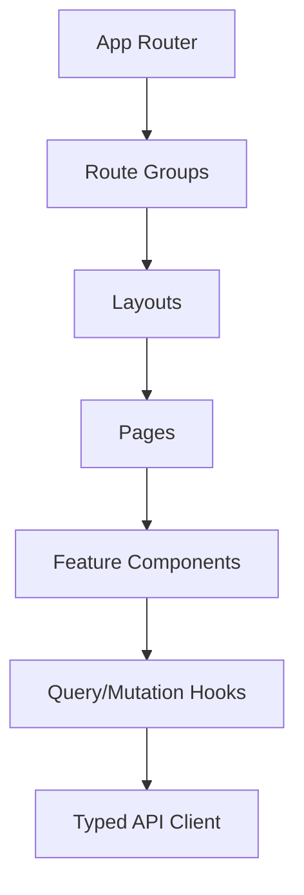
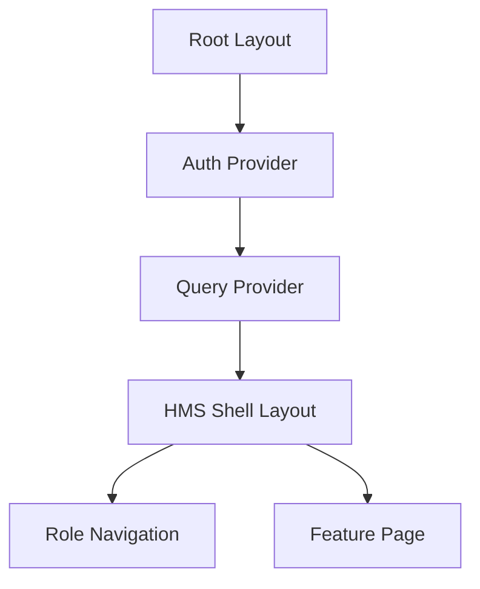

# MYHxCARE Frontend Development Constitution

**Document Type:** Frontend Engineering Lawbook  
**Product:** MYHxCARE HMS  
**Phase 1 Deployment:** Nnamdi Azikiwe University Medical Centre  
**Applies To:** Next.js, TypeScript, PWA, TanStack Query, React Hook Form, Zod, WebSockets, Service Workers, IndexedDB, Tailwind CSS  
**Status:** Binding for all MYHxCARE frontend development  

---

## 1. Frontend Engineering Philosophy

### 1.1 Constitution Rule
Every MYHxCARE frontend must protect clinical safety, preserve user work, remain accessible, handle unreliable networks, prevent accidental harmful actions, and behave predictably for every authorized role.

### 1.2 Clinical Safety First
Clinical safety is the first frontend requirement.

Frontend code must:

- make the active patient visible on every clinical screen
- prevent accidental submissions for prescriptions, discharges, stock adjustments, and payments
- show pending/offline/synced state clearly
- never hide validation errors
- never silently discard clinical drafts
- clearly distinguish draft, submitted, verified, amended, cancelled, and failed states

### 1.3 Simplicity
Frontend code must use the simplest implementation that satisfies product, accessibility, security, and offline requirements.

Required:

- feature-based modules
- typed API clients
- shared UI primitives
- Zod schemas for all form validation
- TanStack Query for server state
- local state for local UI only

Forbidden:

- business rules hidden in random components
- duplicate server state in global stores
- large all-purpose components
- untyped API responses
- role checks implemented only by hiding buttons

### 1.4 Predictability
The same action must behave the same way everywhere.

Required:

- all save buttons show loading state
- all destructive actions require confirmation
- all forms show field-level validation
- all lists use standard pagination/filtering
- all API errors use standard display mapping
- all offline drafts show visible sync status

### 1.5 Accessibility
Every screen must meet WCAG 2.1 AA minimum. Clinical workflows must work with keyboard, screen reader, high contrast, reduced motion, and touch input.

### 1.6 Offline Readiness
The HMS must remain usable during slow networks, temporary backend outages, and interrupted connections.

Offline-ready does not mean every action is safe offline. The UI must clearly classify actions as:

- available offline
- draft-only offline
- read-only offline
- online-required

### 1.7 Progressive Enhancement
Core workflows must load and remain understandable before advanced enhancements run.

Examples:

- patient identity visible before charts load
- draft form usable before WebSocket connects
- lists usable without real-time updates
- notifications retrievable through REST if WebSocket fails

### 1.8 Defensive UI Design
Frontend engineers must assume:

- networks fail
- users double-click
- users switch patients accidentally
- users lose sessions
- requests timeout
- WebSockets disconnect
- cached data becomes stale
- browser storage can be cleared

Before writing code, engineers must answer:

| Question | Required Answer |
|---|---|
| What role can access this? | Permission and route guard. |
| Is the action clinically or financially risky? | Confirmation and idempotency behavior. |
| Can this work offline? | Offline classification and UI state. |
| What happens if the request fails? | Recovery path and error message. |
| What happens if user refreshes? | Draft/session preservation rule. |
| What API contract is used? | Typed service and query/mutation hook. |
| What test proves safety? | Unit/component/E2E/accessibility test. |

---

## 2. Application Architecture

### 2.1 Official Architecture
MYHxCARE HMS uses Next.js App Router with feature-based modules. Routes compose layouts and pages. Features own domain UI, hooks, schemas, service bindings, and tests. Shared components are generic and domain-free.



### 2.2 App Router Structure
Use route groups to separate authenticated HMS areas from public/auth flows.

```text
src/app/
  (public)/
    login/
    password-reset/
  (hms)/
    layout.tsx
    dashboard/
    admissions/
    clinicals/
    wards/
    pharmacy/
    laboratory/
    billing/
    revenue/
    emergency/
    administration/
    collaboration/
    notifications/
  api-health/
  not-found.tsx
  error.tsx
  loading.tsx
```

### 2.3 Layout Hierarchy



### 2.4 Module Boundaries
Each feature module owns its:

- pages if route-specific
- feature components
- query hooks
- mutation hooks
- Zod schemas
- local types
- tests

Feature modules must not import private files from another feature. Cross-feature usage must go through shared services, shared types, or approved public feature exports.

### 2.5 Domain Boundaries
Domain separation is mandatory:

| Domain | Frontend Feature |
|---|---|
| Admissions and Records | `features/admissions` |
| Clinicals | `features/clinicals` |
| Ward Management | `features/wards` |
| Pharmacy | `features/pharmacy` |
| Laboratory | `features/laboratory` |
| Billing | `features/billing` |
| Revenue | `features/revenue` |
| Emergency | `features/emergency` |
| Administration | `features/administration` |
| Notifications | `features/notifications` |
| Clinical Collaboration | `features/collaboration` |

---

## 3. Project Structure

### 3.1 Official Structure

```text
src/
  app/
  components/
    ui/
    layout/
    feedback/
    data-display/
    forms/
  features/
    admissions/
    clinicals/
    wards/
    pharmacy/
    laboratory/
    billing/
    revenue/
    emergency/
    administration/
    notifications/
    collaboration/
    mobile-support/
  hooks/
  services/
    api/
    websocket/
    storage/
    sync/
  stores/
  providers/
  utils/
  types/
  constants/
  assets/
  tests/
    unit/
    component/
    integration/
    e2e/
    accessibility/
```

### 3.2 `src/app/`
Contains routes, layouts, loading, error, and not-found boundaries.

Allowed:

- route files
- layout files
- page composition
- route metadata
- route-level guards

Must never contain:

- business logic
- raw API calls
- large reusable components
- form schemas
- domain-specific hooks

### 3.3 `src/components/`
Contains shared reusable components that are domain-neutral.

Allowed:

- buttons
- inputs
- modals
- tables
- badges
- layout shell
- empty states
- error states

Must never contain:

- patient registration business logic
- prescription workflow logic
- pharmacy stock rules
- billing calculations

### 3.4 `src/features/`
Contains domain-specific frontend modules.

Required feature structure:

```text
features/wards/
  components/
  hooks/
  schemas/
  services/
  types/
  utils/
  tests/
  index.ts
```

### 3.5 `src/hooks/`
Contains generic hooks only.

Allowed:

- `useDebounce`
- `useMediaQuery`
- `usePrevious`
- `useOnlineStatus`

Must never contain:

- `usePatients`
- `usePrescriptions`
- `useWardAdmissions`

Domain hooks belong in feature folders.

### 3.6 `src/services/`
Contains technical service clients.

Allowed:

- API client
- WebSocket client
- IndexedDB wrappers
- sync queue service
- FCM registration wrapper

Must never contain:

- React components
- role-specific UI behavior
- form validation schemas

### 3.7 `src/stores/`
Contains minimal global client state.

Allowed:

- auth/session display state
- UI shell preferences
- selected facility/location
- temporary app-wide banners

Must never contain:

- server lists
- patients
- prescriptions
- invoices
- lab results
- bed availability as source of truth

### 3.8 `src/providers/`
Contains root providers:

- AuthProvider
- QueryProvider
- ThemeProvider
- WebSocketProvider
- OfflineSyncProvider
- PermissionProvider

### 3.9 `src/utils/`
Contains pure utility functions.

Must not contain API calls, React hooks, mutable global state, or domain workflows.

### 3.10 `src/types/`
Contains shared types only.

Feature-specific types remain inside feature folders.

### 3.11 `src/constants/`
Contains stable constants:

- route names
- query keys
- permission strings
- status values

### 3.12 `src/assets/`
Contains static assets, icons, and images.

Must never contain PHI, production documents, or real patient screenshots.

### 3.13 `src/tests/`
Contains cross-feature tests. Feature-local tests should live beside the feature.

---

## 4. Feature-Based Architecture

### 4.1 Constitution Rule
Every business capability must be implemented inside its feature module. A feature must expose only approved public APIs through `index.ts`.

### 4.2 Required Feature Contract
Each feature must contain:

- components
- hooks
- schemas
- services
- types
- tests
- public exports

Example:

```text
features/pharmacy/
  components/DispensePrescriptionForm.tsx
  hooks/useDispensePrescription.ts
  schemas/dispensePrescriptionSchema.ts
  services/pharmacyApi.ts
  types/pharmacy.types.ts
  tests/DispensePrescriptionForm.test.tsx
  index.ts
```

### 4.3 Feature Isolation Rules
Feature modules must not:

- import another feature's internal components
- mutate another feature's query cache without an approved shared event
- duplicate another feature's API client
- own global navigation state

### 4.4 Official Feature Boundaries

| Feature | Owns |
|---|---|
| Admissions | patient registration, demographics, folders, dependents |
| Clinicals | consultations, notes, diagnoses, treatment plans, prescriptions |
| Ward Management | wards, beds, admissions, transfers, discharges, rounds |
| Pharmacy | inventory, dispensing, stock adjustments, transfers |
| Laboratory | lab orders, samples, results, verification, blood bank |
| Billing | charges, invoices, payments, refunds |
| Revenue | cost centres and revenue analytics |
| Emergency | alerts, acknowledgements, escalation UI |
| Administration | staff, service pricing, operational dashboards |
| Notifications | notification centre, preferences, push registration |
| Collaboration | clinical discussions, messages, read receipts |
| Mobile Support | web support endpoints/views for student mobile workflows |

---

## 5. Component Architecture

### 5.1 Component Types

| Type | Purpose | Location |
|---|---|---|
| Page component | Route composition | `src/app/**/page.tsx` |
| Layout component | Shell/navigation/structure | `components/layout` |
| Feature component | Domain UI | `features/{feature}/components` |
| Shared component | Reusable domain-neutral UI | `components/ui` |
| Presentational component | Stateless display | feature or shared |
| Container component | Data-bound composition | feature only |

### 5.2 Naming Conventions

Required:

```text
PatientRegistrationForm.tsx
WardOccupancyTable.tsx
DispensePrescriptionDialog.tsx
EmergencyAlertBanner.tsx
useCreateWardAdmission.ts
patientRegistrationSchema.ts
```

Forbidden:

```text
Form.tsx
Table2.tsx
NewComponent.tsx
apiStuff.ts
helper.ts
```

### 5.3 Page Component Rule
Page components must compose. They must not contain heavy business logic.

Allowed:

```tsx
export default function WardAdmissionsPage() {
  return <WardAdmissionsScreen />;
}
```

Forbidden:

```tsx
export default function Page() {
  const [form, setForm] = useState(...)
  fetch(...)
  // 300 lines of workflow logic
}
```

### 5.4 Shared Component Rule
Shared components must be domain-neutral.

Allowed:

```tsx
<ConfirmDialog />
<DataTable />
<StatusBadge />
<FieldError />
```

Forbidden:

```tsx
<PatientDischargeConfirmDialog />
```

in `components/ui`. It belongs in `features/wards`.

### 5.5 Anti-Patterns
Forbidden:

- components above 250 lines without approved reason
- API calls inside presentational components
- hidden role checks in visual-only components
- form validation without Zod
- uncontrolled clinical forms without draft strategy

---

## 6. State Management Constitution

### 6.1 State Categories

| State Type | Tool |
|---|---|
| Local UI state | `useState`, `useReducer` |
| Server state | TanStack Query |
| Form state | React Hook Form |
| Global UI/session state | Context or lightweight store |
| Offline persistent drafts | IndexedDB |
| Real-time ephemeral state | WebSocket provider + query invalidation |

### 6.2 Local State
Use local state for:

- modal open state
- selected tab
- temporary filters before submit
- UI toggles

Do not use local state for server data that has already been fetched.

### 6.3 Server State
All API data must be managed by TanStack Query unless there is a documented exception.

Required:

```tsx
const query = useQuery({
  queryKey: patientKeys.detail(patientId),
  queryFn: () => patientsApi.getPatient(patientId),
});
```

### 6.4 Global State
Global state must be minimal.

Allowed:

- current authenticated user summary
- permissions
- current location/campus context
- layout/sidebar state

Forbidden:

- patient lists
- invoices
- prescriptions
- lab results
- pharmacy inventory as source of truth

### 6.5 Prevent Re-Renders
Required:

- keep query selectors narrow
- memoize expensive derived values
- split large forms into subcomponents
- avoid passing new object literals deeply
- use stable query keys

Forbidden:

- global store updates on every keystroke for large clinical forms
- context providers containing frequently changing large objects

---

## 7. API Integration Constitution

### 7.1 API Client Rule
All HTTP calls must go through typed API clients in `services/api` or feature service files.

Forbidden:

```tsx
fetch("/api/v1/patients")
```

inside components.

Required:

```tsx
patientsApi.listPatients(params)
```

### 7.2 API Standards Alignment
Frontend must comply with MYHxCARE API Standards Constitution:

- `/api/v1/`
- camelCase JSON bodies
- snake_case query params
- standard response envelope
- standard error envelope
- `X-Request-ID`
- `X-Correlation-ID`
- `Idempotency-Key` for required operations

### 7.3 Query Hooks
Query hooks must be feature-owned.

```tsx
export function usePatient(patientId: string) {
  return useQuery({
    queryKey: patientKeys.detail(patientId),
    queryFn: () => patientsApi.getPatient(patientId),
    enabled: Boolean(patientId),
  });
}
```

### 7.4 Mutation Hooks
Mutation hooks must:

- use typed input
- map API errors
- invalidate or update affected queries
- show success/failure feedback through approved mechanism
- include idempotency key for critical retryable actions

### 7.5 Retries
Default query retry:

- GET requests: 2 retries for network/server transient errors
- POST/PATCH unsafe operations: no automatic retry unless idempotency key exists
- emergency alerts: retry only through approved emergency workflow

### 7.6 Request Cancellation
Search and typeahead requests must be cancellable.

Use TanStack Query cancellation or AbortController.

### 7.7 Optimistic Updates
Optimistic updates are allowed only when rollback is safe.

Allowed:

- mark notification as read
- update UI preference

Forbidden:

- dispensing medication
- admitting patient to bed
- posting payment
- discharging patient
- verifying lab result

### 7.8 Offline Synchronization
Offline writes must go through offline queue service. Components must never implement ad hoc local queues.

---

## 8. Form Engineering Constitution

### 8.1 Required Tools
All complex forms must use:

- React Hook Form
- Zod
- typed schema inference
- standard field components

### 8.2 Required Form Pattern

```tsx
const form = useForm<PatientRegistrationInput>({
  resolver: zodResolver(patientRegistrationSchema),
  mode: "onBlur",
  defaultValues,
});
```

### 8.3 Validation Strategy
Validation layers:

| Layer | Responsibility |
|---|---|
| Zod schema | client-side format and required fields |
| API validation | authoritative validation |
| Domain/backend | business invariants |

Frontend validation must never be treated as the only validation.

### 8.4 Error Display Standards
Every field error must:

- appear next to the field
- be announced to screen readers
- use plain language
- preserve user input

Form-level errors must appear at top and focus must move to the error summary after failed submit.

### 8.5 Autosave Standards
Autosave is required for:

- consultation notes
- clinical notes
- long lab request forms
- ward round notes

Autosave must:

- save to IndexedDB first
- show last saved time
- distinguish local draft from server-synced draft
- never autosubmit final clinical actions

### 8.6 High-Risk Form Rules
High-risk forms require confirmation:

- prescriptions
- discharges
- payments
- refunds
- stock adjustments
- lab result verification
- emergency resolution

---

## 9. PWA Constitution

### 9.1 PWA Rule
MYHxCARE HMS must install as a PWA and provide an app shell capable of loading during network interruption.

### 9.2 Service Worker Responsibilities
Service worker handles:

- app shell caching
- static asset caching
- offline fallback page
- background sync where supported
- update detection

Service worker must not:

- cache sensitive API responses blindly
- bypass authentication
- store tokens
- serve stale clinical data without visible stale indicator

### 9.3 Caching Strategies

| Strategy | Use For |
|---|---|
| Cache First | static assets, fonts, icons |
| Network First | authenticated API reads where freshness matters |
| Stale While Revalidate | reference data and non-critical dashboards |

### 9.4 App Shell
App shell includes:

- layout shell
- route skeletons
- offline banner
- navigation frame
- auth/session status area

### 9.5 Update Strategy
When a new service worker is available:

- show update banner
- allow user to finish current form
- never force refresh during active clinical documentation

### 9.6 Versioning
App version must be visible in support/about area and included in frontend logs.

---

## 10. Offline First Healthcare Strategy

### 10.1 Offline Classification

| Workflow | Offline Behavior |
|---|---|
| Consultation notes | Draft preserved locally, submit online |
| Vitals logging | Queue if policy allows, otherwise draft |
| Prescriptions | Draft only offline, final submit online |
| Ward admission | Online required |
| Bed allocation | Online required |
| Dispensing | Online required |
| Payments | Online required |
| Emergency alert | Attempt online, queue retry with clear risk indicator |

### 10.2 IndexedDB Standards
IndexedDB stores:

- encrypted/local protected drafts where possible
- sync queue metadata
- reference data cache
- app version metadata

IndexedDB must not store:

- access tokens
- refresh tokens
- unbounded clinical history
- permanent source-of-truth records

### 10.3 Draft Preservation
Drafts must include:

- draft ID
- tenant ID
- actor ID
- patient ID where relevant
- feature
- payload
- schema version
- created time
- updated time
- sync status

### 10.4 Conflict Resolution
When server data changed while user was offline:

- do not overwrite silently
- show comparison where clinically relevant
- require user decision or supervisor workflow
- preserve both local draft and server version

### 10.5 If Internet Disappears
Consultation notes:

- continue typing
- autosave locally
- show offline banner
- disable final submit
- sync when online after review

Vitals:

- preserve locally
- show queued/draft status
- require timestamp confirmation before sync

Prescriptions:

- allow draft only
- show "Cannot submit prescription while offline"
- require online revalidation before final submission

---

## 11. WebSocket Constitution

### 11.1 WebSocket Rule
WebSockets accelerate delivery. REST and persisted data remain source of truth.

### 11.2 Connection Lifecycle
Client must:

1. connect after authentication
2. send access token securely
3. receive connection acknowledgement
4. subscribe only to authorized channels
5. heartbeat periodically
6. reconnect with exponential backoff
7. resync missed events via REST after reconnect

### 11.3 Reconnect Strategy
Backoff:

```text
1s, 2s, 5s, 10s, 30s, then every 60s
```

After reconnect:

```text
GET /api/v1/notifications?after_cursor={lastCursor}
```

### 11.4 Event Handling
WebSocket events must:

- validate event type
- validate resource IDs
- update query cache carefully
- never create permanent source-of-truth state alone

### 11.5 Use Cases
Allowed:

- clinical collaboration
- notifications
- read receipts
- emergency alerts
- presence indicators

Presence is advisory only. Duty roster remains source of truth.

---

## 12. Accessibility Constitution

### 12.1 Standard
MYHxCARE HMS must meet WCAG 2.1 AA minimum.

### 12.2 Keyboard Navigation
Every interactive element must be keyboard reachable and operable.

Forbidden:

- clickable div without role and keyboard handling
- modal without focus trap
- dropdown that cannot be closed with Escape

### 12.3 Screen Readers
Required:

- semantic HTML first
- labels for inputs
- `aria-describedby` for errors/help text
- live regions for alerts and form errors
- meaningful page titles

### 12.4 Focus Management
Required:

- focus first invalid field after validation failure
- focus modal title when opened
- return focus to trigger after modal closes
- focus emergency alert banner when critical and safe

### 12.5 Color Independence
Status must not be communicated by color alone.

Use text/icon plus color:

```text
Available
Occupied
Critical
Pending verification
```

### 12.6 Motion Reduction
Respect `prefers-reduced-motion`.

Critical alerts may use motion sparingly but must have non-motion indicators.

### 12.7 Touch Targets
Minimum touch target:

```text
44px x 44px
```

### 12.8 Healthcare Requirements
Clinical screens must support:

- high contrast
- large readable text
- clear patient identity
- reduced cognitive load
- no hidden critical actions

---

## 13. Performance Constitution

### 13.1 Performance Budgets

| Metric | Target |
|---|---:|
| Initial authenticated shell load | < 3s on typical hospital network |
| Route transition | < 500ms perceived |
| Interaction response | < 100ms local feedback |
| List render | < 200ms for visible rows |
| JS per initial route | < 250 KB gzip target |
| Image assets | optimized and lazy loaded |

### 13.2 Code Splitting
Feature routes must be split by route group.

Large components must be dynamically imported:

- charts
- report builders
- rich text editors
- large tables

### 13.3 Data Fetching
Rules:

- fetch route-critical data at screen boundary
- avoid waterfall requests
- use parallel queries when independent
- use prefetch on predictable navigation

### 13.4 Virtualization
Use virtualization for lists above 100 visible/scrollable items.

Examples:

- patient search results
- inventory table
- audit logs
- notifications

### 13.5 Bundle Optimization
Forbidden:

- importing entire icon libraries
- large date libraries without tree-shaking
- unused chart packages in initial shell

### 13.6 Rendering Strategy
Authenticated clinical pages should prefer client-side data fetching with secure API calls. Public/auth pages may use server rendering where appropriate.

---

## 14. Error Handling Constitution

### 14.1 Error Types

| Error | UI Behavior |
|---|---|
| Network error | Show retry and offline state |
| Validation error | Field-level messages |
| Authorization error | Explain no access, hide unsafe actions |
| Server error | Safe generic message and request ID |
| Offline error | Explain action availability |
| Emergency workflow error | Show prominent retry/escalation path |

### 14.2 Error Display
Errors must:

- preserve user input
- include request ID for support when available
- use plain language
- avoid technical stack traces
- avoid blaming the user

### 14.3 Error Boundaries
Every route group must have an error boundary.

Clinical form errors must not crash the entire app shell.

### 14.4 Emergency Errors
Emergency alert failure must:

- remain visible
- provide retry
- show connection state
- never imply help was notified unless server accepted the alert

---

## 15. UI Safety Constitution

### 15.1 High-Risk Actions
High-risk actions include:

- prescription submission
- patient discharge
- bed transfer
- payment posting
- refund approval
- stock adjustment
- lab result verification
- emergency resolution

### 15.2 Confirmation Pattern
High-risk actions require:

- clear title
- patient/resource summary
- consequence statement
- confirm button with action-specific label
- cancel button
- loading state
- duplicate-submit protection

Example confirm label:

```text
Submit Prescription
Discharge Patient
Post Payment
Verify Result
```

Forbidden generic label:

```text
OK
Yes
Submit
```

### 15.3 Duplicate Submission Prevention
All high-risk submit buttons must:

- disable while pending
- use idempotency key where API requires it
- prevent double-click duplicate mutation
- show final state after success

### 15.4 Active Patient Safety
Clinical pages must show:

- patient name
- patient number
- age/date of birth
- gender
- current location/ward if relevant

When switching patients with unsaved draft, show warning.

---

## 16. Role Based UI Constitution

### 16.1 Rule
Role-based UI is a usability layer, not a security boundary. Backend authorization remains authoritative.

### 16.2 Menu Visibility
Navigation menus must show only features the user has permission to access.

### 16.3 Route Protection
Protected routes must:

- require authenticated session
- check required permission
- redirect or show access denied state
- never render sensitive data while permission is unknown

### 16.4 Action Visibility
Actions must be:

- hidden if never allowed
- disabled with reason if temporarily unavailable
- confirmed if high-risk

### 16.5 Role Standards

| Role | Primary UI Access |
|---|---|
| Doctors | consultations, prescriptions, referrals, clinical timeline |
| Nurses | vitals, ward rounds, nursing assignments, ward patients |
| Pharmacists | dispensing, inventory, stock transfers |
| Lab Scientists | orders, samples, results, verification |
| Records Officers | registration, folders, demographics |
| Accountants | invoices, payments, refunds, revenue reports |
| Administrators | staff, pricing, reports, dashboards |
| Emergency Staff | emergency alerts, acknowledgements, escalation |

---

## 17. Notification Constitution

### 17.1 Channels
Allowed:

- in-app notifications
- WebSocket notifications
- FCM push notifications

Forbidden:

- SMS

### 17.2 Notification Priority

| Priority | Examples | UI Behavior |
|---|---|---|
| Critical | emergency alert, critical lab value | interruptive banner/modal where safe |
| High | referral, urgent collaboration | visible toast + notification centre |
| Normal | appointment, result ready | notification centre + badge |
| Low | informational | notification centre only |

### 17.3 Critical Alerts
Critical alerts must:

- remain visible until acknowledged or resolved
- include sound/visual cue where policy allows
- work with reduced motion
- support keyboard acknowledgement
- log acknowledgement metadata

### 17.4 Push Notifications
FCM payloads must not contain sensitive clinical details. Push should contain minimal text and deep link to authenticated app screen.

---

## 18. Testing Constitution

### 18.1 Unit Tests
Required for:

- utilities
- schema validation
- permission helpers
- data mapping
- reducers

### 18.2 Component Tests
Required for:

- forms
- high-risk action dialogs
- data tables
- error states
- offline banners

### 18.3 Integration Tests
Required for:

- feature screens with mocked API
- query/mutation flows
- WebSocket event handling
- offline draft recovery

### 18.4 E2E Tests
Required critical flows:

- login
- patient registration
- consultation note draft and submit
- ward admission
- prescription creation
- dispensing flow
- lab result verification
- payment posting
- emergency alert acknowledgement

### 18.5 Accessibility Testing
Required:

- automated axe tests
- keyboard-only tests for critical flows
- screen reader label checks
- focus management checks

### 18.6 Coverage Requirements

| Area | Minimum |
|---|---:|
| Shared utilities | 85% |
| Feature hooks | 80% |
| Critical forms | 85% |
| High-risk workflows | E2E required |
| Accessibility | No critical violations |

---

## 19. Code Quality Constitution

### 19.1 TypeScript Rules
Required:

- strict mode enabled
- no implicit any
- no unchecked API response types
- no `as any` except with documented approval

### 19.2 Naming

| Item | Standard |
|---|---|
| Components | PascalCase |
| Hooks | `useX` |
| Files | PascalCase for components, camelCase for utilities |
| Types | PascalCase |
| Constants | UPPER_SNAKE_CASE or named objects |
| Enums | Prefer union literals unless enum required |

### 19.3 Comments
Comments explain why, not what.

Allowed:

```tsx
// Prescriptions cannot be submitted offline because stock and allergy checks are server-authoritative.
```

Forbidden:

```tsx
// Set loading to true
```

### 19.4 Anti-Patterns
Forbidden:

- `any` spreading through feature code
- API calls directly in components
- duplicated validation schemas
- duplicate patient state in global store and query cache
- silent catch blocks
- hiding errors
- localStorage for tokens
- SMS notification UI

---

## 20. Security Constitution

### 20.1 Authentication
Frontend must not invent auth state. It must rely on backend-issued session/token state.

### 20.2 Token Handling
Rules:

- never store refresh tokens in localStorage
- never log tokens
- never expose tokens in URLs
- clear session state on logout
- handle token expiration gracefully

### 20.3 XSS Prevention
Required:

- never render unsanitized HTML
- avoid `dangerouslySetInnerHTML`
- sanitize rich text if unavoidable
- escape user-generated content

### 20.4 CSRF Protection
If cookie auth is used, include CSRF token strategy. If bearer tokens are used, do not mix unsafe cookie assumptions.

### 20.5 Secure Storage
IndexedDB may store drafts but must not store auth secrets.

### 20.6 WebSocket Security
WebSocket must:

- authenticate
- reconnect only with valid session
- stop on logout
- not leak events across tenants or roles

### 20.7 Audit Awareness
Frontend must send correlation IDs and preserve request IDs for support, but audit authority belongs to backend.

---

## 21. Observability Constitution

### 21.1 Frontend Logging
Log frontend errors safely with:

- app version
- route
- user role, if safe
- request ID
- correlation ID
- browser/network information

Never log PHI, tokens, passwords, full clinical notes, or payment secrets.

### 21.2 Performance Monitoring
Track:

- route load time
- API latency from client perspective
- WebSocket disconnects
- offline duration
- sync queue failures
- long tasks

### 21.3 User Journey Tracking
Track workflow events without PHI:

- started registration
- submitted consultation
- opened emergency alert
- acknowledged notification

### 21.4 Correlation IDs
Every API request must include or propagate `X-Correlation-ID`.

UI error displays must show request ID when available.

---

## 22. Frontend Review Checklist

### 22.1 Architecture Review
- Feature boundary respected.
- No cross-feature private imports.
- Shared components are domain-neutral.
- Route group and layout rules followed.

### 22.2 Accessibility Review
- Keyboard navigation works.
- Focus management works.
- Labels and errors are screen-reader accessible.
- Color is not the only status indicator.
- Touch targets meet minimum size.

### 22.3 Security Review
- No tokens in localStorage.
- No sensitive data in logs.
- No unsafe HTML rendering.
- Route protection implemented.
- Action visibility follows permissions.

### 22.4 Testing Review
- Unit/component tests added.
- E2E tests added for critical flow.
- Error states tested.
- Offline state tested where relevant.
- Accessibility checks pass.

### 22.5 Performance Review
- Route code split where needed.
- No unnecessary large dependency.
- Lists are paginated/virtualized.
- Query waterfalls avoided.
- Bundle budget respected.

### 22.6 Clinical Safety Review
- Active patient is visible.
- High-risk action has confirmation.
- Duplicate submission prevented.
- Offline/sync status visible.
- Drafts preserved.
- Dangerous actions disabled offline.

No frontend change may be released until this checklist passes.

---

## 23. Reference Implementations

### 23.1 Admissions: Patient Registration

```tsx
const patientRegistrationSchema = z.object({
  category: z.enum(["student", "staff", "dependent"]),
  firstName: z.string().min(1),
  lastName: z.string().min(1),
  dateOfBirth: z.string(),
  gender: z.enum(["male", "female", "other"]),
});

export function PatientRegistrationForm() {
  const form = useForm<PatientRegistrationInput>({
    resolver: zodResolver(patientRegistrationSchema),
    mode: "onBlur",
  });
  const createPatient = useCreatePatient();

  return (
    <Form {...form}>
      <form onSubmit={form.handleSubmit((values) => createPatient.mutate(values))}>
        <PatientIdentityFields />
        <Button type="submit" disabled={createPatient.isPending}>
          Register Patient
        </Button>
      </form>
    </Form>
  );
}
```

### 23.2 Consultations: Draft-Safe Notes

```tsx
export function ConsultationNoteEditor({ patientId, consultationId }: Props) {
  const draft = useOfflineDraft({
    feature: "consultations",
    resourceId: consultationId,
  });
  const submitNote = useSubmitClinicalNote();

  return (
    <ClinicalWorkspace patientId={patientId}>
      <OfflineDraftBanner status={draft.status} lastSavedAt={draft.lastSavedAt} />
      <ClinicalNoteForm
        defaultValues={draft.value}
        onAutosave={draft.save}
        onSubmit={(values) => submitNote.mutate({ consultationId, ...values })}
      />
    </ClinicalWorkspace>
  );
}
```

### 23.3 Ward Management: Safe Admission

```tsx
export function AdmitPatientDialog({ patient, bed }: Props) {
  const admit = useCreateWardAdmission();

  return (
    <ConfirmDialog
      title="Admit Patient to Bed"
      confirmLabel="Admit Patient"
      isPending={admit.isPending}
      consequence={`This assigns ${patient.fullName} to bed ${bed.code}.`}
      onConfirm={() => admit.mutate({ patientId: patient.id, bedId: bed.id })}
    />
  );
}
```

### 23.4 Pharmacy: No Optimistic Dispensing

```tsx
export function DispensePrescriptionButton({ prescriptionId }: Props) {
  const dispense = useDispensePrescription({ optimistic: false });

  return (
    <ConfirmDialog
      title="Dispense Prescription"
      confirmLabel="Dispense Medication"
      consequence="Stock will be reduced after the server confirms availability."
      onConfirm={() => dispense.mutate({ prescriptionId })}
    />
  );
}
```

### 23.5 Laboratory: Result Verification

```tsx
export function VerifyLabResultAction({ resultId }: Props) {
  const verify = useVerifyLabResult();

  return (
    <ConfirmDialog
      title="Verify Laboratory Result"
      confirmLabel="Verify Result"
      consequence="Verified results become visible to authorized clinicians and cannot be overwritten."
      onConfirm={() => verify.mutate({ resultId })}
    />
  );
}
```

### 23.6 Billing: Payment Posting

```tsx
export function PostPaymentForm({ invoiceId }: Props) {
  const idempotencyKey = useIdempotencyKey();
  const postPayment = usePostPayment();

  return (
    <PaymentForm
      onSubmit={(values) =>
        postPayment.mutate({ invoiceId, idempotencyKey, ...values })
      }
    />
  );
}
```

### 23.7 Emergency Alerts

```tsx
export function EmergencyAlertBanner({ alert }: Props) {
  const acknowledge = useAcknowledgeEmergencyAlert();

  return (
    <CriticalAlert role="alert" aria-live="assertive">
      <EmergencySummary alert={alert} />
      <Button onClick={() => acknowledge.mutate({ alertId: alert.id })}>
        Acknowledge Emergency
      </Button>
    </CriticalAlert>
  );
}
```

### 23.8 Clinical Collaboration

```tsx
export function DiscussionMessages({ discussionId }: Props) {
  const messages = useDiscussionMessages(discussionId);
  useDiscussionWebSocket(discussionId);

  return (
    <MessageList
      messages={messages.data ?? []}
      onVisible={(messageId) => markDiscussionRead(discussionId, messageId)}
    />
  );
}
```

### 23.9 Notifications

```tsx
export function NotificationCentre() {
  const notifications = useNotifications();
  useNotificationSocket();

  return (
    <NotificationList
      notifications={notifications.data?.items ?? []}
      emptyState="No notifications"
    />
  );
}
```

---

## Final Binding Rule

If frontend code conflicts with this Constitution, the frontend code is wrong.

If a UI request conflicts with clinical safety, accessibility, security, or offline reliability requirements, the conflict must be escalated before implementation.

MYHxCARE frontend development must be consistent, accessible, secure, offline-aware, clinically safe, and predictable across every role and workflow.

